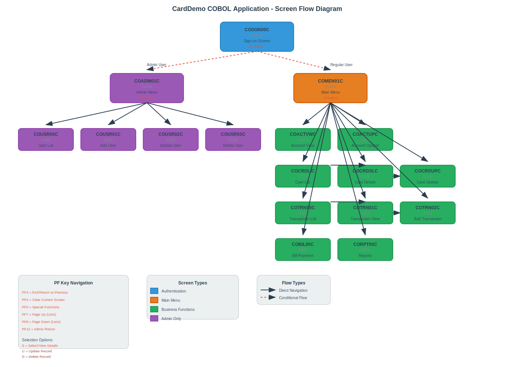

# CardDemo CICS Application - Screen Flow Analysis

## Overview

This document provides a comprehensive analysis of the CardDemo CICS application's screen flow patterns, extracted from 18 COBOL programs in the `00.phase-1-input` folder. The analysis focuses on business-level user navigation paths, screen transitions, and interactive flows that drive the application's user experience.

## Visual Screen Flow Diagram



## Application Architecture

The CardDemo application follows a **pseudo-conversational CICS design pattern** with the following key characteristics:

- **Entry Point**: COSGN00C (Sign-on Screen)
- **Role-Based Navigation**: Automatic routing to appropriate menus based on user type
- **Menu-Driven Interface**: Numeric option selection with ENTER key processing
- **Program Transfer**: All navigation uses `EXEC CICS XCTL` commands
- **Screen Management**: BMS (Basic Mapping Support) for terminal I/O
- **State Preservation**: CARDDEMO-COMMAREA maintains context across program transfers

## Main Navigation Flow

### 1. Authentication Flow

| Screen ID | Screen Title | Trigger | Navigates To |
|-----------|--------------|---------|--------------|
| COSGN00C | Sign-on Screen | Valid Admin Credentials | → COADM01C (Admin Menu) |
| COSGN00C | Sign-on Screen | Valid User Credentials | → COMEN01C (Main Menu) |
| COSGN00C | Sign-on Screen | Invalid Credentials | → COSGN00C (Error Message) |

**BMS Map**: COSGN0A/COSGN00  
**Transaction ID**: COSGN  
**Key Navigation**: ENTER to authenticate, PF3 to exit

### 2. Regular User Menu (COMEN01C)

| Option | Description | Target Program | Transaction ID |
|--------|-------------|----------------|----------------|
| 1 | Account Information | COACTVWC | CAVW |
| 2 | Bill Payment | COBIL00C | CB00 |
| 3 | Credit Card Functions | COCRDLIC | CCLI |
| 4 | Transactions | COTRN00C | CT00 |
| 5 | Statements & Reports | CORPT00C | CR00 |

**BMS Map**: COMEN1A/COMEN01  
**Transaction ID**: CM00  
**Key Navigation**: Numeric selection + ENTER, PF3 to sign-off

### 3. Admin Menu (COADM01C)

| Option | Description | Target Program | Transaction ID |
|--------|-------------|----------------|----------------|
| 1 | Account Information | COACTVWC | CAVW |
| 2 | Bill Payment | COBIL00C | CB00 |
| 3 | Credit Card Functions | COCRDLIC | CCLI |
| 4 | Transactions | COTRN00C | CT00 |
| 5 | Statements & Reports | CORPT00C | CR00 |
| 6 | User Administration | COUSR00C | CU00 |

**BMS Map**: COADM1A/COADM01  
**Transaction ID**: CADM  
**Key Navigation**: Numeric selection + ENTER, PF3 to sign-off

## Detailed Screen Flows

### Account Management

#### Account View (COACTVWC)
- **Function**: Display account details and associated credit cards
- **BMS Map**: CACTVWA/COACTVW
- **Transaction ID**: CAVW
- **Navigation**:
  - ENTER: Search for account by ID
  - PF3: Return to calling menu
  - Links to card list and card details

#### Account Update (COACTUPC)
- **Function**: Modify account information with validation
- **BMS Map**: CACTUPA/COACTUPC
- **Transaction ID**: CAUP
- **Navigation**:
  - ENTER: Validate and process updates
  - PF3: Return to calling menu
  - PF5: Save changes
  - Multi-step workflow with confirmation

#### Bill Payment (COBIL00C)
- **Function**: Pay account balance in full
- **BMS Map**: COBIL0A/COBIL00
- **Transaction ID**: CB00
- **Navigation**:
  - ENTER: Process payment
  - PF3: Return to calling menu
  - PF4: Clear screen
  - Confirmation required (Y/N)

### Credit Card Management

#### Card List (COCRDLIC)
- **Function**: Display paginated list of credit cards
- **BMS Map**: CCRDLIA/COCRDLI
- **Transaction ID**: CCLI
- **Navigation**:
  - ENTER: Process selection
  - PF3: Return to calling menu
  - PF7: Page up
  - PF8: Page down
  - Selection codes: S (Select for details), U (Update)

| Selection | Action | Target Program |
|-----------|--------|----------------|
| S | View Card Details | COCRDSLC |
| U | Update Card | COCRDUPC |

#### Card Details (COCRDSLC)
- **Function**: Display detailed credit card information
- **BMS Map**: CCRDSLA/COCRDSL
- **Transaction ID**: CCDL
- **Navigation**:
  - ENTER: Search by account/card number
  - PF3: Return to calling program

#### Card Update (COCRDUPC)
- **Function**: Modify credit card information
- **BMS Map**: CCRDUPA/COCRDUP
- **Transaction ID**: CCUP
- **Navigation**:
  - ENTER: Validate input
  - PF3: Return to calling program
  - PF5: Save changes
  - Multi-step workflow with validation

### Transaction Management

#### Transaction List (COTRN00C)
- **Function**: Display paginated transaction history
- **BMS Map**: COTRN0A/COTRN00
- **Transaction ID**: CT00
- **Navigation**:
  - ENTER: Process selection or search
  - PF3: Return to main menu
  - PF7: Page up
  - PF8: Page down
  - Selection code: S (Select for details)

| Selection | Action | Target Program |
|-----------|--------|----------------|
| S | View Transaction Details | COTRN01C |

#### Transaction View (COTRN01C)
- **Function**: Display detailed transaction information
- **BMS Map**: COTRN1A/COTRN01
- **Transaction ID**: CT01
- **Navigation**:
  - ENTER: Search by transaction ID
  - PF3: Return to calling program
  - PF4: Clear screen
  - PF5: Return to transaction list

#### Add Transaction (COTRN02C)
- **Function**: Create new transaction record
- **BMS Map**: COTRN2A/COTRN02
- **Transaction ID**: CT02
- **Navigation**:
  - ENTER: Validate and process
  - PF3: Return to calling program
  - PF4: Clear screen
  - PF5: Copy last transaction data
  - Confirmation required (Y/N)

### User Administration (Admin Only)

#### User List (COUSR00C)
- **Function**: Display paginated list of system users
- **BMS Map**: COUSR0A/COUSR00
- **Transaction ID**: CU00
- **Navigation**:
  - ENTER: Process selection
  - PF3: Return to admin menu
  - PF7: Page up
  - PF8: Page down
  - Selection codes: U (Update), D (Delete)

| Selection | Action | Target Program |
|-----------|--------|----------------|
| U | Update User | COUSR02C |
| D | Delete User | COUSR03C |

#### Add User (COUSR01C)
- **Function**: Create new user account
- **BMS Map**: COUSR1A/COUSR01
- **Transaction ID**: CU01
- **Navigation**:
  - ENTER: Validate and create user
  - PF3: Return to admin menu
  - PF4: Clear screen

#### Update User (COUSR02C)
- **Function**: Modify existing user information
- **BMS Map**: COUSR2A/COUSR02
- **Transaction ID**: CU02
- **Navigation**:
  - ENTER: Load user data
  - PF3: Save and return
  - PF4: Clear screen
  - PF5: Save changes
  - PF12: Cancel and return

#### Delete User (COUSR03C)
- **Function**: Remove user from system
- **BMS Map**: COUSR3A/COUSR03
- **Transaction ID**: CU03
- **Navigation**:
  - ENTER: Load user data
  - PF3: Return to calling program
  - PF4: Clear screen
  - PF5: Confirm deletion
  - PF12: Cancel and return

### Reports and Utilities

#### Reports (CORPT00C)
- **Function**: Generate transaction reports via batch job submission
- **BMS Map**: CORPT0A/CORPT00
- **Transaction ID**: CR00
- **Navigation**:
  - ENTER: Submit report job
  - PF3: Return to main menu
- **Report Types**:
  - Monthly reports (current month)
  - Yearly reports (current year)
  - Custom date range reports

#### Date Utility (CSUTLDTC)
- **Function**: Date validation utility called by other programs
- **Type**: Utility program (not interactive)
- **Usage**: Called via CALL statement for date validation

## Standard PF Key Functions

| PF Key | Function | Available In |
|--------|----------|--------------|
| PF3 | Exit to previous screen or sign-on | All screens |
| PF4 | Clear current screen | Most input screens |
| PF5 | Save changes or return to list | Update screens, Transaction view |
| PF7 | Page up | List screens (Transactions, Cards, Users) |
| PF8 | Page down | List screens (Transactions, Cards, Users) |
| PF12 | Cancel and return to admin menu | User administration screens |

## Technical Implementation Notes

### Program Transfer Pattern
All screen navigation uses the CICS XCTL command:
```cobol
EXEC CICS XCTL
    PROGRAM (CDEMO-TO-PROGRAM)
    COMMAREA(CARDDEMO-COMMAREA)
END-EXEC
```

### State Management
- **CARDDEMO-COMMAREA**: Main communication area passed between programs
- **Program-specific context**: Each program maintains state in dedicated sections
- **Navigation context**: FROM-PROGRAM and TO-PROGRAM fields track call chains

### Screen I/O Pattern
- **SEND MAP**: Display screen to terminal
- **RECEIVE MAP**: Get user input
- **BMS Maps**: Define screen layouts and field attributes

### Error Handling
- Field-level validation with cursor positioning
- Error messages displayed on same screen
- Consistent error flag patterns across programs

## Data Files and Cross-References

| File | Purpose | Key Programs |
|------|---------|--------------|
| ACCTDAT | Account master data | COACTVWC, COACTUPC, COBIL00C |
| CARDDAT | Credit card data | COCRDLIC, COCRDSLC, COCRDUPC |
| TRANSACT | Transaction records | COTRN00C, COTRN01C, COTRN02C |
| USRSEC | User security data | COUSR00C, COUSR01C, COUSR02C, COUSR03C |
| CXACAIX | Account-card cross-reference | Multiple programs |

## Summary

The CardDemo application provides a comprehensive credit card management system with:

- **18 interactive programs** covering all major business functions
- **Role-based access control** with separate admin and user interfaces
- **Consistent navigation patterns** using standard CICS and BMS techniques
- **Robust error handling** and field validation
- **Paginated list displays** for large data sets
- **Multi-step workflows** for complex operations like updates and deletions

The application demonstrates typical mainframe CICS application design patterns and provides a complete business solution for credit card account management, transaction processing, and system administration.
