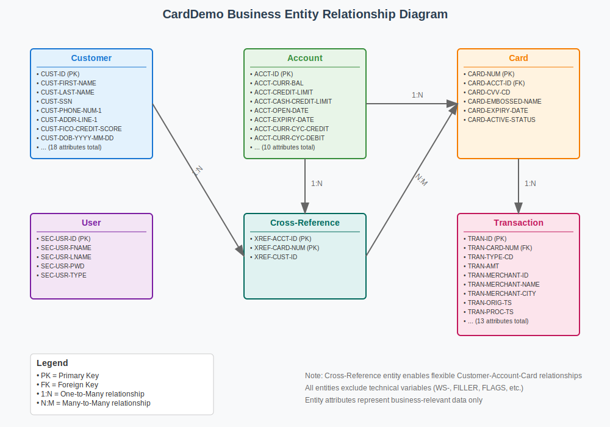

# CardDemo COBOL Legacy System - Business Entities Analysis

## Overview

This document presents the business entities extracted from the CardDemo COBOL legacy system for domain modeling and modernization purposes. The analysis focuses on real-world, business-relevant entities while excluding UI fields, technical variables, and COBOL-specific constructs.

## Business Entities

### 1. Account Entity

**Description**: Represents customer financial accounts with balance information, credit limits, and lifecycle management.

**Attributes**:
- `ACCT-UPDATE-ID` (PIC 9(11)) - Unique account identifier
- `ACCT-UPDATE-ACTIVE-STATUS` (PIC X(01)) - Account status (active/inactive)
- `ACCT-UPDATE-CURR-BAL` (PIC S9(10)V99) - Current account balance
- `ACCT-UPDATE-CREDIT-LIMIT` (PIC S9(10)V99) - Credit limit for the account
- `ACCT-UPDATE-CASH-CREDIT-LIMIT` (PIC S9(10)V99) - Cash advance credit limit
- `ACCT-UPDATE-OPEN-DATE` (PIC X(10)) - Account opening date
- `ACCT-UPDATE-EXPIRAION-DATE` (PIC X(10)) - Account expiration date
- `ACCT-UPDATE-REISSUE-DATE` (PIC X(10)) - Account reissue date
- `ACCT-UPDATE-CURR-CYC-CREDIT` (PIC S9(10)V99) - Current cycle credit amount
- `ACCT-UPDATE-CURR-CYC-DEBIT` (PIC S9(10)V99) - Current cycle debit amount
- `ACCT-UPDATE-GROUP-ID` (PIC X(10)) - Account group identifier

### 2. Customer Entity

**Description**: Contains personal and demographic information for account holders and cardholders.

**Attributes**:
- `CUST-UPDATE-ID` (PIC 9(09)) - Unique customer identifier
- `CUST-UPDATE-FIRST-NAME` (PIC X(25)) - Customer first name
- `CUST-UPDATE-MIDDLE-NAME` (PIC X(25)) - Customer middle name
- `CUST-UPDATE-LAST-NAME` (PIC X(25)) - Customer last name
- `CUST-UPDATE-ADDR-LINE-1` (PIC X(50)) - Primary address line
- `CUST-UPDATE-ADDR-LINE-2` (PIC X(50)) - Secondary address line
- `CUST-UPDATE-ADDR-LINE-3` (PIC X(50)) - Tertiary address line
- `CUST-UPDATE-ADDR-STATE-CD` (PIC X(02)) - State code
- `CUST-UPDATE-ADDR-COUNTRY-CD` (PIC X(03)) - Country code
- `CUST-UPDATE-ADDR-ZIP` (PIC X(10)) - ZIP/postal code
- `CUST-UPDATE-PHONE-NUM-1` (PIC X(15)) - Primary phone number
- `CUST-UPDATE-PHONE-NUM-2` (PIC X(15)) - Secondary phone number
- `CUST-UPDATE-SSN` (PIC 9(09)) - Social Security Number
- `CUST-UPDATE-GOVT-ISSUED-ID` (PIC X(20)) - Government issued ID
- `CUST-UPDATE-DOB-YYYY-MM-DD` (PIC X(10)) - Date of birth
- `CUST-UPDATE-EFT-ACCOUNT-ID` (PIC X(10)) - Electronic funds transfer account ID
- `CUST-UPDATE-PRI-CARD-IND` (PIC X(01)) - Primary card indicator
- `CUST-UPDATE-FICO-CREDIT-SCORE` (PIC 9(03)) - FICO credit score

### 3. Card Entity

**Description**: Physical or virtual credit cards linked to customer accounts with security and status information.

**Attributes**:
- `CARD-UPDATE-NUM` (PIC X(16)) - Credit card number
- `CARD-UPDATE-ACCT-ID` (PIC 9(11)) - Associated account identifier
- `CARD-UPDATE-CVV-CD` (PIC 9(03)) - Card verification value code
- `CARD-UPDATE-EMBOSSED-NAME` (PIC X(50)) - Name embossed on card
- `CARD-UPDATE-EXPIRAION-DATE` (PIC X(10)) - Card expiration date
- `CARD-UPDATE-ACTIVE-STATUS` (PIC X(01)) - Card status (active/inactive)

### 4. Transaction Entity

**Description**: Financial transactions processed against credit cards with merchant and timing details.

**Attributes**:
- `TRAN-ID` (PIC 9(16)) - Unique transaction identifier
- `TRAN-TYPE-CD` (PIC X) - Transaction type code
- `TRAN-CAT-CD` (PIC X) - Transaction category code
- `TRAN-SOURCE` (PIC X) - Transaction source
- `TRAN-DESC` (PIC X) - Transaction description
- `TRAN-AMT` (PIC S9(9)V99) - Transaction amount
- `TRAN-CARD-NUM` (PIC X(16)) - Associated card number
- `TRAN-MERCHANT-ID` (PIC 9) - Merchant identifier
- `TRAN-MERCHANT-NAME` (PIC X) - Merchant name
- `TRAN-MERCHANT-CITY` (PIC X) - Merchant city
- `TRAN-MERCHANT-ZIP` (PIC X) - Merchant ZIP code
- `TRAN-ORIG-TS` (PIC X) - Original transaction timestamp
- `TRAN-PROC-TS` (PIC X) - Processing timestamp

### 5. User Entity

**Description**: System users with authentication credentials and access levels for application security.

**Attributes**:
- `SEC-USR-ID` (PIC X) - User identifier
- `SEC-USR-FNAME` (PIC X) - User first name
- `SEC-USR-LNAME` (PIC X) - User last name
- `SEC-USR-PWD` (PIC X) - User password
- `SEC-USR-TYPE` (PIC X) - User type (admin/regular)

### 6. Card Cross-Reference Entity

**Description**: Cross-reference mapping table enabling navigation between accounts and cards for relationship management.

**Attributes**:
- `XREF-ACCT-ID` (PIC 9(11)) - Account identifier for cross-reference
- `XREF-CARD-NUM` (PIC X(16)) - Card number for cross-reference
- `XREF-CUST-ID` (PIC 9(09)) - Customer identifier for cross-reference

## Entity Relationships

### Primary Relationships

| Relationship | Cardinality | Description |
|--------------|-------------|-------------|
| Customer ↔ Account | 1:N | One customer can have multiple accounts |
| Account ↔ Card | 1:N | One account can have multiple cards |
| Card ↔ Transaction | 1:N | One card can have multiple transactions |
| Account ↔ Card Cross-Reference | 1:1 | Cross-reference for account-card mapping |
| Customer ↔ Card Cross-Reference | 1:N | Customer linked to cards through cross-reference |
| User ↔ System Access | 1:1 | User authentication and authorization |

### Relationship Details

1. **Customer to Account**: Customers can hold multiple financial accounts, each with its own credit limits and balances.

2. **Account to Card**: Each account can have multiple credit cards issued against it, sharing the account's credit limit.

3. **Card to Transaction**: Credit cards accumulate transaction history over time, with each transaction linked to a specific card.

4. **Cross-Reference Relationships**: The Card Cross-Reference entity serves as a junction table linking customers, accounts, and cards, enabling efficient navigation between related entities.

5. **User Access**: System users have authentication credentials and role-based access to manage customer accounts and perform administrative functions.

## Entity Relationship Diagram

## Data Sources

The business entities were extracted from the following COBOL programs and data structures:

- **Account Entity**: `COACTUPC.cbl` - `ACCT-UPDATE-RECORD` structure
- **Customer Entity**: `COACTUPC.cbl` - `CUST-UPDATE-RECORD` structure  
- **Card Entity**: `COCRDUPC.cbl` - `CARD-UPDATE-RECORD` structure
- **Transaction Entity**: `COTRN02C.cbl` - `TRAN-RECORD` usage and field references
- **User Entity**: `COUSR01C.cbl` - `SEC-USR-*` field references
- **Card Cross-Reference**: `COTRN02C.cbl` - `CARD-XREF-RECORD` usage

## Exclusions

The following types of data were intentionally excluded from this business entity analysis:

- UI fields and screen mappings
- Working storage variables (WS-*)
- Technical helper variables (TEMP-, FILLER, FLAGS)
- Control fields, counters, and index variables
- COBOL structure-only items without business context
- Display-related variables and formatting fields

## Modernization Considerations

These business entities represent the core domain model for the CardDemo credit card management system and provide the foundation for:

- Domain-driven design implementation
- Microservices architecture planning
- API design and data modeling
- Database schema modernization
- Business logic extraction and refactoring

The entities capture the essential business concepts and relationships needed to understand and modernize the legacy COBOL system while maintaining business continuity.
