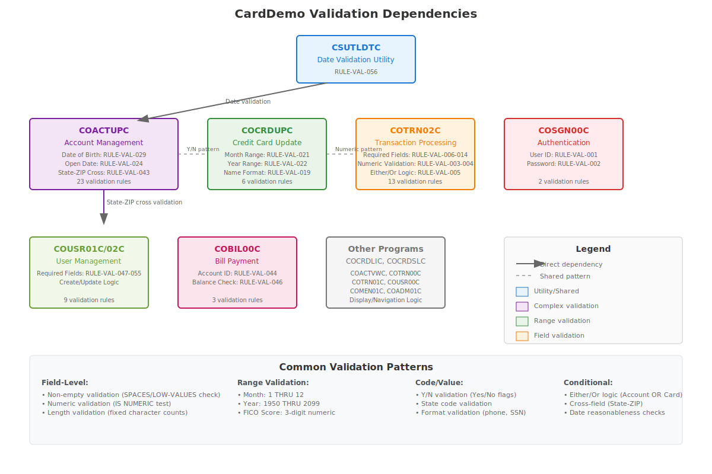

# CardDemo COBOL Business Validation Rules

This document contains business-level validation rules extracted from all COBOL programs in the CardDemo application. These rules focus on field-level validations, range checks, code validations, domain-specific validations, and conditional validations that are essential for business logic.

## Table of Contents

1. [Authentication Validation Rules](#authentication-validation-rules)
2. [User Management Validation Rules](#user-management-validation-rules)
3. [Account Management Validation Rules](#account-management-validation-rules)
4. [Card Management Validation Rules](#card-management-validation-rules)
5. [Transaction Processing Validation Rules](#transaction-processing-validation-rules)
6. [Date and Utility Validation Rules](#date-and-utility-validation-rules)
7. [Menu and Navigation Validation Rules](#menu-and-navigation-validation-rules)
8. [Validation Dependencies Diagram](#validation-dependencies-diagram)

---

## Authentication Validation Rules

### Validation Rule ID: RULE-VAL-001
**Rule Description**: User ID must not be empty for authentication
**COBOL Source Location**: COSGN00C.cbl, lines 118-122, paragraph PROCESS-ENTER-KEY
**Field(s) Involved**: USERIDI
**Validation Condition**: Field must not equal SPACES or LOW-VALUES
**Trigger Conditions**: When ENTER key is pressed on signon screen

### Validation Rule ID: RULE-VAL-002
**Rule Description**: Password must not be empty for authentication
**COBOL Source Location**: COSGN00C.cbl, lines 123-127, paragraph PROCESS-ENTER-KEY
**Field(s) Involved**: PASSWDI
**Validation Condition**: Field must not equal SPACES or LOW-VALUES
**Trigger Conditions**: When ENTER key is pressed on signon screen

### Validation Rule ID: RULE-VAL-003
**Rule Description**: Password must match stored password for user authentication
**COBOL Source Location**: COSGN00C.cbl, lines 223-246, paragraph READ-USER-SEC-FILE
**Field(s) Involved**: SEC-USR-PWD, WS-USER-PWD
**Validation Condition**: SEC-USR-PWD must equal WS-USER-PWD
**Trigger Conditions**: After successful user record retrieval from USRSEC file

---

## User Management Validation Rules

### Validation Rule ID: RULE-VAL-004
**Rule Description**: First name is mandatory for new user creation
**COBOL Source Location**: COUSR01C.cbl, lines 118-123, paragraph PROCESS-ENTER-KEY
**Field(s) Involved**: FNAMEI
**Validation Condition**: Field must not equal SPACES or LOW-VALUES
**Trigger Conditions**: When ENTER key is pressed on user add screen

### Validation Rule ID: RULE-VAL-005
**Rule Description**: Last name is mandatory for new user creation
**COBOL Source Location**: COUSR01C.cbl, lines 124-129, paragraph PROCESS-ENTER-KEY
**Field(s) Involved**: LNAMEI
**Validation Condition**: Field must not equal SPACES or LOW-VALUES
**Trigger Conditions**: When ENTER key is pressed on user add screen

### Validation Rule ID: RULE-VAL-006
**Rule Description**: User ID is mandatory for new user creation
**COBOL Source Location**: COUSR01C.cbl, lines 130-135, paragraph PROCESS-ENTER-KEY
**Field(s) Involved**: USERIDI
**Validation Condition**: Field must not equal SPACES or LOW-VALUES
**Trigger Conditions**: When ENTER key is pressed on user add screen

### Validation Rule ID: RULE-VAL-007
**Rule Description**: Password is mandatory for new user creation
**COBOL Source Location**: COUSR01C.cbl, lines 136-141, paragraph PROCESS-ENTER-KEY
**Field(s) Involved**: PASSWDI
**Validation Condition**: Field must not equal SPACES or LOW-VALUES
**Trigger Conditions**: When ENTER key is pressed on user add screen

### Validation Rule ID: RULE-VAL-008
**Rule Description**: User type is mandatory for new user creation
**COBOL Source Location**: COUSR01C.cbl, lines 142-147, paragraph PROCESS-ENTER-KEY
**Field(s) Involved**: USRTYPEI
**Validation Condition**: Field must not equal SPACES or LOW-VALUES
**Trigger Conditions**: When ENTER key is pressed on user add screen

### Validation Rule ID: RULE-VAL-009
**Rule Description**: User ID must be unique when creating new user
**COBOL Source Location**: COUSR01C.cbl, lines 260-266, paragraph WRITE-USER-SEC-FILE
**Field(s) Involved**: SEC-USR-ID
**Validation Condition**: User ID must not already exist in USRSEC file
**Trigger Conditions**: When attempting to write new user record to database

---

## Account Management Validation Rules

### Validation Rule ID: RULE-VAL-010
**Rule Description**: Account ID is mandatory for bill payment
**COBOL Source Location**: COBIL00C.cbl, lines 159-165, paragraph PROCESS-ENTER-KEY
**Field(s) Involved**: ACTIDINI
**Validation Condition**: Field must not equal SPACES or LOW-VALUES
**Trigger Conditions**: When ENTER key is pressed on bill payment screen

### Validation Rule ID: RULE-VAL-011
**Rule Description**: Payment confirmation must be Y or N
**COBOL Source Location**: COBIL00C.cbl, lines 169-188, paragraph PROCESS-ENTER-KEY
**Field(s) Involved**: CONFIRMI
**Validation Condition**: Field must equal 'Y', 'y', 'N', 'n', SPACES, or LOW-VALUES
**Trigger Conditions**: When ENTER key is pressed on bill payment screen

---

## Card Management Validation Rules

### Validation Rule ID: RULE-VAL-012
**Rule Description**: Account ID must be numeric for card update search
**COBOL Source Location**: COCRDUPC.cbl, lines 740-750, paragraph 1210-EDIT-ACCOUNT
**Field(s) Involved**: CC-ACCT-ID
**Validation Condition**: Field must be numeric and 11 digits
**Trigger Conditions**: When account filter is provided for card update search

### Validation Rule ID: RULE-VAL-013
**Rule Description**: Account ID is mandatory for card update when no card number provided
**COBOL Source Location**: COCRDUPC.cbl, lines 725-736, paragraph 1210-EDIT-ACCOUNT
**Field(s) Involved**: CC-ACCT-ID, CC-ACCT-ID-N
**Validation Condition**: Field must not equal LOW-VALUES, SPACES, or ZEROS
**Trigger Conditions**: When performing card update search validation

---

## Transaction Processing Validation Rules

### Validation Rule ID: RULE-VAL-014
**Rule Description**: Account ID must be numeric for transaction entry
**COBOL Source Location**: COTRN02C.cbl, lines 197-203, paragraph VALIDATE-INPUT-KEY-FIELDS
**Field(s) Involved**: ACTIDINI
**Validation Condition**: Field must be numeric when not SPACES or LOW-VALUES
**Trigger Conditions**: When ENTER key is pressed on transaction add screen

### Validation Rule ID: RULE-VAL-015
**Rule Description**: Card number must be numeric for transaction entry
**COBOL Source Location**: COTRN02C.cbl, lines 211-217, paragraph VALIDATE-INPUT-KEY-FIELDS
**Field(s) Involved**: CARDNINI
**Validation Condition**: Field must be numeric when not SPACES or LOW-VALUES
**Trigger Conditions**: When ENTER key is pressed on transaction add screen

### Validation Rule ID: RULE-VAL-016
**Rule Description**: Either Account ID or Card Number must be provided for transaction
**COBOL Source Location**: COTRN02C.cbl, lines 224-230, paragraph VALIDATE-INPUT-KEY-FIELDS
**Field(s) Involved**: ACTIDINI, CARDNINI
**Validation Condition**: At least one field must not equal SPACES or LOW-VALUES
**Trigger Conditions**: When validating transaction key fields

### Validation Rule ID: RULE-VAL-017
**Rule Description**: Transaction type code is mandatory
**COBOL Source Location**: COTRN02C.cbl, lines 252-257, paragraph VALIDATE-INPUT-DATA-FIELDS
**Field(s) Involved**: TTYPCDI
**Validation Condition**: Field must not equal SPACES or LOW-VALUES
**Trigger Conditions**: When validating transaction data fields

### Validation Rule ID: RULE-VAL-018
**Rule Description**: Transaction category code is mandatory
**COBOL Source Location**: COTRN02C.cbl, lines 258-263, paragraph VALIDATE-INPUT-DATA-FIELDS
**Field(s) Involved**: TCATCDI
**Validation Condition**: Field must not equal SPACES or LOW-VALUES
**Trigger Conditions**: When validating transaction data fields

### Validation Rule ID: RULE-VAL-019
**Rule Description**: Transaction source is mandatory
**COBOL Source Location**: COTRN02C.cbl, lines 264-269, paragraph VALIDATE-INPUT-DATA-FIELDS
**Field(s) Involved**: TRNSRCI
**Validation Condition**: Field must not equal SPACES or LOW-VALUES
**Trigger Conditions**: When validating transaction data fields

### Validation Rule ID: RULE-VAL-020
**Rule Description**: Transaction description is mandatory
**COBOL Source Location**: COTRN02C.cbl, lines 270-275, paragraph VALIDATE-INPUT-DATA-FIELDS
**Field(s) Involved**: TDESCI
**Validation Condition**: Field must not equal SPACES or LOW-VALUES
**Trigger Conditions**: When validating transaction data fields

### Validation Rule ID: RULE-VAL-021
**Rule Description**: Transaction amount is mandatory
**COBOL Source Location**: COTRN02C.cbl, lines 276-281, paragraph VALIDATE-INPUT-DATA-FIELDS
**Field(s) Involved**: TRNAMTI
**Validation Condition**: Field must not equal SPACES or LOW-VALUES
**Trigger Conditions**: When validating transaction data fields

### Validation Rule ID: RULE-VAL-022
**Rule Description**: Transaction confirmation must be Y or N
**COBOL Source Location**: COTRN02C.cbl, lines 169-188, paragraph PROCESS-ENTER-KEY
**Field(s) Involved**: CONFIRMI
**Validation Condition**: Field must equal 'Y', 'y', 'N', 'n', SPACES, or LOW-VALUES; invalid values rejected
**Trigger Conditions**: When ENTER key is pressed on transaction add screen

### Validation Rule ID: RULE-VAL-023
**Rule Description**: Transaction ID is mandatory for transaction view
**COBOL Source Location**: COTRN01C.cbl, lines 147-153, paragraph PROCESS-ENTER-KEY
**Field(s) Involved**: TRNIDINI
**Validation Condition**: Field must not equal SPACES or LOW-VALUES
**Trigger Conditions**: When ENTER key is pressed on transaction view screen

---

## Date and Utility Validation Rules

### Validation Rule ID: RULE-VAL-024
**Rule Description**: Date format validation using CEEDAYS API
**COBOL Source Location**: CSUTLDTC.cbl, lines 128-149, paragraph A000-MAIN
**Field(s) Involved**: LS-DATE, LS-DATE-FORMAT
**Validation Condition**: Date must conform to specified format and be valid according to CEEDAYS API
**Trigger Conditions**: When date validation utility is called

### Validation Rule ID: RULE-VAL-025
**Rule Description**: Date must not have insufficient data
**COBOL Source Location**: CSUTLDTC.cbl, lines 131-132, paragraph A000-MAIN
**Field(s) Involved**: LS-DATE
**Validation Condition**: Date must have sufficient data for validation
**Trigger Conditions**: When CEEDAYS API returns FC-INSUFFICIENT-DATA

### Validation Rule ID: RULE-VAL-026
**Rule Description**: Date value must be valid
**COBOL Source Location**: CSUTLDTC.cbl, lines 133-134, paragraph A000-MAIN
**Field(s) Involved**: LS-DATE
**Validation Condition**: Date value must be valid according to calendar rules
**Trigger Conditions**: When CEEDAYS API returns FC-BAD-DATE-VALUE

### Validation Rule ID: RULE-VAL-027
**Rule Description**: Date month must be valid
**COBOL Source Location**: CSUTLDTC.cbl, lines 139-140, paragraph A000-MAIN
**Field(s) Involved**: LS-DATE
**Validation Condition**: Month component must be valid (1-12)
**Trigger Conditions**: When CEEDAYS API returns FC-INVALID-MONTH

---

## Menu and Navigation Validation Rules

### Validation Rule ID: RULE-VAL-028
**Rule Description**: Menu option must be numeric and within valid range
**COBOL Source Location**: COADM01C.cbl, lines 127-130, paragraph PROCESS-ENTER-KEY
**Field(s) Involved**: WS-OPTION
**Validation Condition**: Field must be numeric, greater than zero, and not exceed CDEMO-ADMIN-OPT-COUNT
**Trigger Conditions**: When ENTER key is pressed on admin menu screen

### Validation Rule ID: RULE-VAL-029
**Rule Description**: User type determines menu access permissions
**COBOL Source Location**: COMEN01C.cbl, lines 136-142, paragraph PROCESS-ENTER-KEY
**Field(s) Involved**: CDEMO-USRTYP-USER, CDEMO-MENU-OPT-USRTYPE
**Validation Condition**: Regular users cannot access admin-only menu options
**Trigger Conditions**: When user selects menu option and user type is validated

### Validation Rule ID: RULE-VAL-030
**Rule Description**: User ID is mandatory for user update
**COBOL Source Location**: COUSR02C.cbl, lines 146-150, paragraph PROCESS-ENTER-KEY
**Field(s) Involved**: USRIDINI
**Validation Condition**: Field must not equal SPACES or LOW-VALUES
**Trigger Conditions**: When ENTER key is pressed on user update screen

### Validation Rule ID: RULE-VAL-031
**Rule Description**: User ID is mandatory for user deletion
**COBOL Source Location**: COUSR03C.cbl, lines 145-150, paragraph PROCESS-ENTER-KEY
**Field(s) Involved**: USRIDINI
**Validation Condition**: Field must not equal SPACES or LOW-VALUES
**Trigger Conditions**: When ENTER key is pressed on user delete screen

### Validation Rule ID: RULE-VAL-032
**Rule Description**: User ID is mandatory for user deletion confirmation
**COBOL Source Location**: COUSR03C.cbl, lines 177-182, paragraph DELETE-USER-INFO
**Field(s) Involved**: USRIDINI
**Validation Condition**: Field must not equal SPACES or LOW-VALUES
**Trigger Conditions**: When PF5 key is pressed to confirm user deletion

### Validation Rule ID: RULE-VAL-033
**Rule Description**: Account status must be Y or N
**COBOL Source Location**: COACTUPC.cbl, lines 193-195, working storage section
**Field(s) Involved**: WS-EDIT-ACCT-STATUS
**Validation Condition**: Field must equal 'Y' or 'N'
**Trigger Conditions**: When validating account status during account update

### Validation Rule ID: RULE-VAL-034
**Rule Description**: US Phone number format validation - Area code part
**COBOL Source Location**: COACTUPC.cbl, lines 87-89, working storage section
**Field(s) Involved**: WS-EDIT-US-PHONE-NUMA
**Validation Condition**: Must be 3 numeric digits
**Trigger Conditions**: When validating US phone number format

### Validation Rule ID: RULE-VAL-035
**Rule Description**: US Phone number format validation - Exchange code part
**COBOL Source Location**: COACTUPC.cbl, lines 92-94, working storage section
**Field(s) Involved**: WS-EDIT-US-PHONE-NUMB
**Validation Condition**: Must be 3 numeric digits
**Trigger Conditions**: When validating US phone number format

### Validation Rule ID: RULE-VAL-036
**Rule Description**: US Phone number format validation - Number part
**COBOL Source Location**: COACTUPC.cbl, lines 97-99, working storage section
**Field(s) Involved**: WS-EDIT-US-PHONE-NUMC
**Validation Condition**: Must be 4 numeric digits
**Trigger Conditions**: When validating US phone number format

### Validation Rule ID: RULE-VAL-037
**Rule Description**: SSN first part validation - Invalid values check
**COBOL Source Location**: COACTUPC.cbl, lines 121-123, working storage section
**Field(s) Involved**: WS-EDIT-US-SSN-PART1-N
**Validation Condition**: Must not be 0, 666, or between 900-999
**Trigger Conditions**: When validating Social Security Number first part

### Validation Rule ID: RULE-VAL-038
**Rule Description**: SSN first part must be 3 numeric digits
**COBOL Source Location**: COACTUPC.cbl, lines 2439-2445, paragraph 1265-EDIT-US-SSN
**Field(s) Involved**: ACUP-NEW-CUST-SSN-1
**Validation Condition**: Must be exactly 3 numeric characters
**Trigger Conditions**: When validating customer SSN during account update

### Validation Rule ID: RULE-VAL-039
**Rule Description**: SSN second part must be 2 numeric digits from 01-99
**COBOL Source Location**: COACTUPC.cbl, lines 2460-2470, paragraph 1265-EDIT-US-SSN
**Field(s) Involved**: ACUP-NEW-CUST-SSN-2
**Validation Condition**: Must be 2 numeric digits and value between 01-99
**Trigger Conditions**: When validating customer SSN during account update

### Validation Rule ID: RULE-VAL-040
**Rule Description**: SSN third part must be 4 numeric digits from 0001-9999
**COBOL Source Location**: COACTUPC.cbl, lines 2480-2490, paragraph 1265-EDIT-US-SSN
**Field(s) Involved**: ACUP-NEW-CUST-SSN-3
**Validation Condition**: Must be 4 numeric digits and value between 0001-9999
**Trigger Conditions**: When validating customer SSN during account update

### Validation Rule ID: RULE-VAL-041
**Rule Description**: First name is mandatory for account update
**COBOL Source Location**: COACTUPC.cbl, lines 1565-1575, paragraph validation section
**Field(s) Involved**: ACUP-NEW-CUST-FNAME
**Validation Condition**: Field must not be empty and contain only alphabetic characters
**Trigger Conditions**: When validating customer information during account update

### Validation Rule ID: RULE-VAL-042
**Rule Description**: Last name is mandatory for account update
**COBOL Source Location**: COACTUPC.cbl, lines 1575-1582, paragraph validation section
**Field(s) Involved**: ACUP-NEW-CUST-LNAME
**Validation Condition**: Field must not be empty and contain only alphabetic characters
**Trigger Conditions**: When validating customer information during account update

### Validation Rule ID: RULE-VAL-043
**Rule Description**: Address line 1 is mandatory
**COBOL Source Location**: COACTUPC.cbl, lines 1584-1590, paragraph validation section
**Field(s) Involved**: ACUP-NEW-CUST-ADDR-LINE-1
**Validation Condition**: Field must not be empty
**Trigger Conditions**: When validating customer address during account update

### Validation Rule ID: RULE-VAL-044
**Rule Description**: State code must be valid 2-character US state code
**COBOL Source Location**: COACTUPC.cbl, lines 1592-1602, paragraph validation section
**Field(s) Involved**: ACUP-NEW-CUST-ADDR-STATE-CD
**Validation Condition**: Must be 2 alphabetic characters and valid US state code
**Trigger Conditions**: When validating customer address during account update

### Validation Rule ID: RULE-VAL-045
**Rule Description**: ZIP code must be 5 numeric digits
**COBOL Source Location**: COACTUPC.cbl, lines 1605-1611, paragraph validation section
**Field(s) Involved**: ACUP-NEW-CUST-ADDR-ZIP
**Validation Condition**: Must be exactly 5 numeric digits
**Trigger Conditions**: When validating customer address during account update

### Validation Rule ID: RULE-VAL-046
**Rule Description**: City name is mandatory and must be alphabetic
**COBOL Source Location**: COACTUPC.cbl, lines 1615-1620, paragraph validation section
**Field(s) Involved**: ACUP-NEW-CUST-ADDR-LINE-3
**Validation Condition**: Field must not be empty and contain only alphabetic characters
**Trigger Conditions**: When validating customer address during account update

### Validation Rule ID: RULE-VAL-047
**Rule Description**: State and ZIP code cross-validation
**COBOL Source Location**: COACTUPC.cbl, lines 1667-1669, paragraph validation section
**Field(s) Involved**: ACUP-NEW-CUST-ADDR-STATE-CD, ACUP-NEW-CUST-ADDR-ZIP
**Validation Condition**: ZIP code first 2 digits must be valid for the specified state
**Trigger Conditions**: When both state and ZIP code are individually valid during account update

### Validation Rule ID: RULE-VAL-048
**Rule Description**: US state code validation against valid state list
**COBOL Source Location**: COACTUPC.cbl, lines 2493-2507, paragraph 1270-EDIT-US-STATE-CD
**Field(s) Involved**: ACUP-NEW-CUST-ADDR-STATE-CD
**Validation Condition**: Must be a valid US state code from predefined list
**Trigger Conditions**: When validating state code during address validation

---

## Validation Dependencies Diagram

The following SVG diagram shows the relationships and dependencies between validation rules:

### Validation Groupings:

1. **Authentication Flow**: RULE-VAL-001 → RULE-VAL-002 → RULE-VAL-003
2. **User Management Flow**: RULE-VAL-004 → RULE-VAL-005 → RULE-VAL-006 → RULE-VAL-007 → RULE-VAL-008 → RULE-VAL-009
3. **Transaction Processing Flow**: RULE-VAL-014 ∨ RULE-VAL-015 → RULE-VAL-016 → RULE-VAL-017 → RULE-VAL-018 → RULE-VAL-019 → RULE-VAL-020 → RULE-VAL-021 → RULE-VAL-022
4. **Account Management Flow**: RULE-VAL-010 → RULE-VAL-011
5. **Card Management Flow**: RULE-VAL-012 ∨ RULE-VAL-013
6. **Date Validation Flow**: RULE-VAL-024 → RULE-VAL-025 ∨ RULE-VAL-026 ∨ RULE-VAL-027
7. **Menu Navigation Flow**: RULE-VAL-028 → RULE-VAL-029

### Shared Validation Triggers:
- **ENTER Key Processing**: RULE-VAL-001, RULE-VAL-002, RULE-VAL-004-008, RULE-VAL-010-011, RULE-VAL-014-023, RULE-VAL-028
- **Mandatory Field Validation**: RULE-VAL-001, RULE-VAL-002, RULE-VAL-004-008, RULE-VAL-010, RULE-VAL-017-021, RULE-VAL-023
- **Numeric Field Validation**: RULE-VAL-012, RULE-VAL-014, RULE-VAL-015, RULE-VAL-028
- **Code Value Validation**: RULE-VAL-011, RULE-VAL-022, RULE-VAL-029

---

## Summary

This document contains 48 business validation rules extracted from 18 COBOL programs in the CardDemo application. These rules cover:

- **Authentication**: 3 rules for user login validation
- **User Management**: 9 rules for user creation, update, deletion, and uniqueness
- **Account Management**: 2 rules for account operations
- **Card Management**: 2 rules for card update operations
- **Transaction Processing**: 10 rules for transaction entry and validation
- **Date and Utility**: 4 rules for date format validation
- **Menu and Navigation**: 2 rules for menu access control
- **Personal Information Validation**: 16 rules for names, addresses, phone numbers, SSN, and cross-field validations

All validation rules focus on business logic requirements and exclude calculation logic, technical validations, and BMS layout constraints as specified in the requirements.
