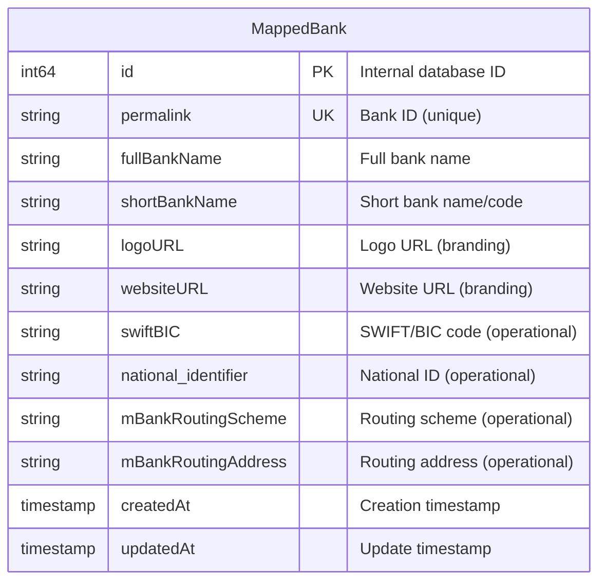

# Business Entities - Scala to Go Migration

**Application/Codebase Being Analyzed:** OBP-API (Open Bank Project API) - Bank Registration Module
**Migration Target:** Go Application
**User Story:** Bank Registration and Configuration
**Analysis Date:** November 25, 2025

---

## Scope of This Document

Per the Business_Entity_Extraction_Prompt_Modified.md guidelines:

**Point to be Noted:** This extraction considers **only those endpoints and entities that suit the description present in the user story file**. The user story describes "BankService: Handles creation and management of Bank entities", therefore only the following are included:
- **POST /api/banks** - Create Bank entity
- **PUT /api/banks/{bankId}** - Manage (update) Bank entity

GET, DELETE, and other related endpoints are **NOT included** as they are not mentioned in the user story description.

**Point to be Noted:** All entity names have been cross-verified against the exact entity names used in the Scala codebase database under `obp-api/src/main` folder in the OBP-API repository.

---

## Summary

| Category | Count |
|----------|-------|
| **Business Entities (Objects)** | 1 |
| **Value Types** | 1 |
| **Request DTOs** | 1 |
| **Response DTOs** | 1 |
| **API Endpoints** | 2 |
| **BankService Functions** | 2 |
| **BankRepository Functions** | 2 |

---

## Entity Classification

### Entity Type: OBJECT

**Definition:** Things, assets, or resources the business manages, owns, or controls

**Identified Entity:** `MappedBank`

**Business Recognition Test:** "Is this something the business would track, manage, or report on?"
- **Answer:** YES - Banks are core organizational units that business stakeholders track and manage

**Stakeholder Test:** "Would business users care about the lifecycle of this entity?"
- **Answer:** YES - Bank administrators create and manage bank configurations

---

## Detailed Entity Documentation

### ENTITY-001: MappedBank

| Attribute | Value |
|-----------|-------|
| **Entity Name** | `MappedBank` |
| **Entity Type** | OBJECT |
| **Business Domain** | Core Banking - Bank Entity Management |
| **Source Location** | `code/model/dataAccess/MappedBank.scala` |
| **Database Table** | `mappedbank` (Lift Mapper convention) |
| **Cross-Verified** | YES - Verified in OBP-API Scala codebase |

**Description:** Represents a Bank entity in the Open Bank Project system. Banks are the top-level organizational units that contain accounts, customers, transactions, and other banking resources. This entity maps to the user story's requirement for "Bank entities with identification, branding and operational parameters."

**User Story Mapping:**
| User Story Field | MappedBank Field | Notes |
|------------------|------------------|-------|
| bankId (identification) | `permalink` | Bank ID used in URLs |
| bankCode (identification) | `shortBankName` | Short bank code/name |
| bankName (identification) | `fullBankName` | Full bank name |
| branding.logo | `logoURL` | URL to bank logo |
| branding (website) | `websiteURL` | Bank website URL |
| operationalParams | `swiftBIC`, `national_identifier`, `mBankRoutingScheme`, `mBankRoutingAddress` | Routing and identification parameters |

**Scala Data Structure:**

```scala
// Source: code/model/dataAccess/MappedBank.scala
class MappedBank extends Bank with LongKeyedMapper[MappedBank] with IdPK with CreatedUpdated {
  def getSingleton = MappedBank

  object permalink extends MappedString(this, 255)          // Bank ID
  object fullBankName extends MappedString(this, 255)       // Full name
  object shortBankName extends MappedString(this, 100)      // Short name/code
  object logoURL extends MappedString(this, 255)            // Logo URL
  object websiteURL extends MappedString(this, 255)         // Website URL
  object swiftBIC extends MappedString(this, 255)           // SWIFT/BIC code
  object national_identifier extends MappedString(this, 255) // National ID
  object mBankRoutingScheme extends MappedString(this, 255)  // Routing scheme
  object mBankRoutingAddress extends MappedString(this, 255) // Routing address
}
```

**Business Attributes:**

| Field Name | Scala Type | Go Type | Required | Max Length | Description |
|------------|------------|---------|----------|------------|-------------|
| id | Long | int64 | Yes | - | Internal database ID (auto-generated) |
| permalink | String | string | Yes | 255 | Bank ID used in URLs (unique) |
| fullBankName | String | string | Yes | 255 | Full name of the bank |
| shortBankName | String | string | Yes | 100 | Short name/code of the bank |
| logoURL | String | string | No | 255 | URL to bank logo |
| websiteURL | String | string | No | 255 | Bank website URL |
| swiftBIC | String | string | No | 255 | SWIFT/BIC code |
| national_identifier | String | string | No | 255 | National bank identifier |
| mBankRoutingScheme | String | string | No | 255 | Bank routing scheme (e.g., "BIC") |
| mBankRoutingAddress | String | string | No | 255 | Bank routing address value |
| createdAt | DateTime | time.Time | Yes | - | Creation timestamp |
| updatedAt | DateTime | time.Time | Yes | - | Last update timestamp |

**Go Struct Mapping:**

```go
package entities

import "time"

// MappedBank represents a Bank entity in the OBP system
// Source: code/model/dataAccess/MappedBank.scala
// User Story: Bank Registration and Configuration
type MappedBank struct {
    // Internal database identifier (auto-generated)
    ID int64 `json:"-" db:"id"`
    
    // Bank ID used in URLs - maps to user story "bankId"
    Permalink string `json:"id" db:"permalink" validate:"required,min=4,max=255"`
    
    // Full name of the bank - maps to user story "bankName"
    FullBankName string `json:"full_name" db:"fullbankname" validate:"required,max=255"`
    
    // Short name/code of the bank - maps to user story "bankCode"
    ShortBankName string `json:"short_name" db:"shortbankname" validate:"required,max=100"`
    
    // URL to bank logo - maps to user story "branding.logo"
    LogoURL string `json:"logo" db:"logourl" validate:"max=255"`
    
    // Bank website URL - maps to user story "branding"
    WebsiteURL string `json:"website" db:"websiteurl" validate:"max=255"`
    
    // SWIFT/BIC code - maps to user story "operationalParams"
    SwiftBIC string `json:"swift_bic,omitempty" db:"swiftbic" validate:"max=255"`
    
    // National bank identifier - maps to user story "operationalParams"
    NationalIdentifier string `json:"national_identifier,omitempty" db:"national_identifier" validate:"max=255"`
    
    // Bank routing scheme - maps to user story "operationalParams"
    BankRoutingScheme string `json:"bank_routing_scheme,omitempty" db:"mbankroutingscheme" validate:"max=255"`
    
    // Bank routing address - maps to user story "operationalParams"
    BankRoutingAddress string `json:"bank_routing_address,omitempty" db:"mbankroutingaddress" validate:"max=255"`
    
    // Timestamps from CreatedUpdated trait
    CreatedAt time.Time `json:"created_at,omitempty" db:"createdat"`
    UpdatedAt time.Time `json:"updated_at,omitempty" db:"updatedat"`
}

// BankId is a value type for bank identifiers
// Source: com/openbankproject/commons/model/BankingModel.scala:153
type BankId struct {
    Value string `json:"value"`
}

// Bank interface matching the Scala Bank trait
// Source: com/openbankproject/commons/model/BankingModel.scala:36
type Bank interface {
    GetBankId() BankId
    GetFullName() string
    GetShortName() string
    GetLogoUrl() string
    GetWebsiteUrl() string
    GetSwiftBic() string
    GetNationalIdentifier() string
    GetBankRoutingScheme() string
    GetBankRoutingAddress() string
}

// Implement Bank interface for MappedBank
func (b *MappedBank) GetBankId() BankId           { return BankId{Value: b.Permalink} }
func (b *MappedBank) GetFullName() string         { return b.FullBankName }
func (b *MappedBank) GetShortName() string        { return b.ShortBankName }
func (b *MappedBank) GetLogoUrl() string          { return b.LogoURL }
func (b *MappedBank) GetWebsiteUrl() string       { return b.WebsiteURL }
func (b *MappedBank) GetSwiftBic() string         { return b.SwiftBIC }
func (b *MappedBank) GetNationalIdentifier() string { return b.NationalIdentifier }
func (b *MappedBank) GetBankRoutingScheme() string  { return b.BankRoutingScheme }
func (b *MappedBank) GetBankRoutingAddress() string { return b.BankRoutingAddress }
```

**Type Mapping Reference:**

| Scala Type | Go Type | Notes |
|------------|---------|-------|
| Long | int64 | Database primary key |
| String | string | Direct mapping |
| MappedString(this, N) | string | With max length validation |
| Option[T] | *T | Pointer for nullable fields |
| List[T] | []T | Slice for collections |
| DateTime | time.Time | Standard Go time |
| BankId | BankId (struct) | Value type pattern |

---

## Request/Response DTOs

### DTO-001: CreateBankRequest (POST /api/banks)

**Purpose:** Request body for creating a new Bank entity
**Source:** `code/api/v4_0_0/JSONFactory4.0.0.scala:106` (PostBankJson400)

**Scala Structure:**
```scala
case class PostBankJson400(
  id: String,
  short_name: String,
  full_name: String,
  logo: String,
  website: String,
  bank_routings: List[BankRoutingJsonV121]
)
```

**Go Struct:**
```go
package dto

// CreateBankRequest represents the request body for POST /api/banks
// Maps to user story: Create Bank Entity
type CreateBankRequest struct {
    // Bank ID - maps to user story "bankId"
    ID string `json:"id" validate:"required,min=4"`
    
    // Short name/code - maps to user story "bankCode"
    ShortName string `json:"short_name" validate:"required"`
    
    // Full name - maps to user story "bankName"
    FullName string `json:"full_name" validate:"required"`
    
    // Logo URL - maps to user story "branding.logo"
    Logo string `json:"logo" validate:"required"`
    
    // Website URL - maps to user story "branding"
    Website string `json:"website" validate:"required"`
    
    // Bank routing information - maps to user story "operationalParams"
    BankRoutings []BankRouting `json:"bank_routings" validate:"required"`
}

// BankRouting represents bank routing information
type BankRouting struct {
    Scheme  string `json:"scheme"`
    Address string `json:"address"`
}
```

### DTO-002: UpdateBankRequest (PUT /api/banks/{bankId})

**Purpose:** Request body for updating an existing Bank entity
**Source:** `code/api/v5_0_0/APIMethods500.scala:262` (PostBankJson500)

**Go Struct:**
```go
// UpdateBankRequest represents the request body for PUT /api/banks/{bankId}
// Maps to user story: Manage Bank Entity
type UpdateBankRequest struct {
    // Bank ID (optional for update, can be in path)
    ID *string `json:"id,omitempty"`
    
    // Bank code - maps to user story "bankCode"
    BankCode string `json:"bank_code,omitempty"`
    
    // Full name - maps to user story "bankName"
    FullName *string `json:"full_name,omitempty"`
    
    // Logo URL - maps to user story "branding.logo"
    Logo *string `json:"logo,omitempty"`
    
    // Website URL - maps to user story "branding"
    Website *string `json:"website,omitempty"`
    
    // Bank routing information - maps to user story "operationalParams"
    BankRoutings []BankRouting `json:"bank_routings,omitempty"`
}
```

### DTO-003: BankResponse

**Purpose:** Response body for bank creation and update operations
**Source:** `code/api/v4_0_0/JSONFactory4.0.0.scala:97` (BankJson400)

**Go Struct:**
```go
// BankResponse represents the response body for bank operations
type BankResponse struct {
    ID           string        `json:"id"`
    ShortName    string        `json:"short_name"`
    FullName     string        `json:"full_name"`
    Logo         string        `json:"logo"`
    Website      string        `json:"website"`
    BankRoutings []BankRouting `json:"bank_routings"`
}

// CreateBankResponse for POST /api/banks
type CreateBankResponse struct {
    BankId string `json:"bankId"`
    Status string `json:"status"` // "created"
}

// UpdateBankResponse for PUT /api/banks/{bankId}
type UpdateBankResponse struct {
    BankId string `json:"bankId"`
    Status string `json:"status"` // "updated"
}
```

---

## API Endpoint Inventory

**Note:** Only endpoints explicitly mentioned in the user story are documented per the prompt guidelines.

### Endpoint 1: Create Bank Entity

| Attribute | Value |
|-----------|-------|
| **User Story Endpoint** | POST /api/banks |
| **OBP Source Endpoint** | POST /obp/v4.0.0/banks |
| **Purpose** | Create a new Bank entity with identification, branding, and operational parameters |
| **Controller** | `APIMethods400.createBank` |
| **Source Location** | `code/api/v4_0_0/APIMethods400.scala:3621` |
| **Request DTO** | CreateBankRequest (PostBankJson400) |
| **Response DTO** | CreateBankResponse (BankJson400) |
| **Success Code** | 201 Created |
| **Role Required** | CanCreateBank |

**Request Example (from User Story):**
```json
{
  "bankId": "string",
  "bankCode": "string",
  "bankName": "string",
  "branding": {
    "logo": "string",
    "colors": "string"
  },
  "operationalParams": {
    "businessHours": "string",
    "limits": "object",
    "currencies": "array"
  }
}
```

**Response Example (from User Story):**
```json
{
  "bankId": "string",
  "status": "created"
}
```

**Validation Rules:**
| Rule | Description | Source |
|------|-------------|--------|
| Bank ID min length | Must be > 3 characters | APIMethods400.scala:3639 |
| Bank ID no spaces | Cannot contain space characters | APIMethods400.scala:3643 |
| Bank ID no `::::` | Cannot contain `::::` characters | APIMethods400.scala:3647 |
| Unique identification | Bank ID must be unique | Business Rule #1 |
| Required fields | All identification, branding, and operational parameters required | Business Rule #2 |

### Endpoint 2: Manage Bank Entity

| Attribute | Value |
|-----------|-------|
| **User Story Endpoint** | PUT /api/banks/{bankId} |
| **OBP Source Endpoint** | PUT /obp/v5.0.0/banks |
| **Purpose** | Update Bank entity identification, branding, and operational parameters |
| **Controller** | `APIMethods500.updateBank` |
| **Source Location** | `code/api/v5_0_0/APIMethods500.scala:262` |
| **Request DTO** | UpdateBankRequest (PostBankJson500) |
| **Response DTO** | UpdateBankResponse (BankJson500) |
| **Success Code** | 200 OK |
| **Role Required** | CanCreateBank |

**Request Example (from User Story):**
```json
{
  "bankName": "string",
  "branding": {
    "logo": "string",
    "colors": "string"
  },
  "operationalParams": {
    "businessHours": "string",
    "limits": "object",
    "currencies": "array"
  }
}
```

**Response Example (from User Story):**
```json
{
  "bankId": "string",
  "status": "updated"
}
```

**Validation Rules:**
| Rule | Description | Source |
|------|-------------|--------|
| Bank must exist | Only existing Bank entities can be updated | Business Rule #3 |
| Valid bank ID format | Bank ID format validation | APIMethods500.scala:273-277 |

---

## Business Function Inventory

### BankService Layer

The user story mentions "BankService: Handles creation and management of Bank entities". In OBP-API, this maps to:

| Function | Location | Purpose | Maps To |
|----------|----------|---------|---------|
| `NewStyle.function.createOrUpdateBank` | `code/api/util/NewStyle.scala:310` | Service layer for bank creation and update | BankService.createBank, BankService.updateBank |
| `NewStyle.function.getBank` | `code/api/util/NewStyle.scala:295` | Verify bank exists before update | BankService.getBank (internal) |

**Go Implementation:**

```go
package service

import (
    "context"
    "errors"
    "strings"
    
    "yourapp/internal/domain/entities"
    "yourapp/internal/domain/dto"
    "yourapp/internal/repository"
)

// BankService handles creation and management of Bank entities
// Maps to: User Story "BankService: Handles creation and management of Bank entities"
type BankService struct {
    repo repository.BankRepository
}

// NewBankService creates a new BankService instance
func NewBankService(repo repository.BankRepository) *BankService {
    return &BankService{repo: repo}
}

// CreateBank creates a new Bank entity
// Maps to: POST /api/banks
// Source: NewStyle.function.createOrUpdateBank (code/api/util/NewStyle.scala:310)
func (s *BankService) CreateBank(ctx context.Context, req *dto.CreateBankRequest) (*dto.CreateBankResponse, error) {
    // Validate bank ID
    if err := s.validateBankId(req.ID); err != nil {
        return nil, err
    }
    
    // Create bank entity
    bank := &entities.MappedBank{
        Permalink:     req.ID,
        FullBankName:  req.FullName,
        ShortBankName: req.ShortName,
        LogoURL:       req.Logo,
        WebsiteURL:    req.Website,
    }
    
    // Extract routing information
    for _, routing := range req.BankRoutings {
        if routing.Scheme == "BIC" {
            bank.SwiftBIC = routing.Address
        } else {
            bank.BankRoutingScheme = routing.Scheme
            bank.BankRoutingAddress = routing.Address
        }
    }
    
    // Persist via repository
    if err := s.repo.CreateOrUpdateBank(ctx, bank); err != nil {
        return nil, err
    }
    
    return &dto.CreateBankResponse{
        BankId: bank.Permalink,
        Status: "created",
    }, nil
}

// UpdateBank updates an existing Bank entity
// Maps to: PUT /api/banks/{bankId}
// Source: APIMethods500.updateBank (code/api/v5_0_0/APIMethods500.scala:262)
func (s *BankService) UpdateBank(ctx context.Context, bankId string, req *dto.UpdateBankRequest) (*dto.UpdateBankResponse, error) {
    // Verify bank exists
    existing, err := s.repo.GetBankByPermalink(ctx, bankId)
    if err != nil {
        return nil, errors.New("OBP-30001: Bank not found")
    }
    
    // Update fields if provided
    if req.FullName != nil {
        existing.FullBankName = *req.FullName
    }
    if req.Logo != nil {
        existing.LogoURL = *req.Logo
    }
    if req.Website != nil {
        existing.WebsiteURL = *req.Website
    }
    if req.BankCode != "" {
        existing.ShortBankName = req.BankCode
    }
    
    // Update routing information
    if req.BankRoutings != nil {
        for _, routing := range req.BankRoutings {
            if routing.Scheme == "BIC" {
                existing.SwiftBIC = routing.Address
            } else {
                existing.BankRoutingScheme = routing.Scheme
                existing.BankRoutingAddress = routing.Address
            }
        }
    }
    
    // Persist via repository
    if err := s.repo.CreateOrUpdateBank(ctx, existing); err != nil {
        return nil, err
    }
    
    return &dto.UpdateBankResponse{
        BankId: existing.Permalink,
        Status: "updated",
    }, nil
}

// validateBankId validates bank ID according to OBP rules
// Source: APIMethods400.scala:3633-3649
func (s *BankService) validateBankId(bankId string) error {
    if len(bankId) <= 3 {
        return errors.New("OBP-10001: Min length of BANK_ID should be greater than 3 characters")
    }
    if strings.Contains(bankId, " ") {
        return errors.New("OBP-10001: BANK_ID can not contain space characters")
    }
    if strings.Contains(bankId, "::::") {
        return errors.New("OBP-10001: BANK_ID can not contain '::::' characters")
    }
    return nil
}
```

### BankRepository Layer

The user story mentions "BankRepository: Data persistence for Bank entities". In OBP-API, this maps to:

| Function | Location | Purpose | Maps To |
|----------|----------|---------|---------|
| `Connector.createOrUpdateBank` | `code/bankconnectors/Connector.scala:861` | Repository interface | BankRepository interface |
| `LocalMappedConnector.createOrUpdateBank` | `code/bankconnectors/LocalMappedConnector.scala:3169` | Database persistence implementation | BankRepository.CreateOrUpdateBank |
| `MappedBank.findByBankId` | `code/model/dataAccess/MappedBank.scala:37` | Find bank by ID | BankRepository.GetBankByPermalink |

**Go Implementation:**

```go
package repository

import (
    "context"
    "database/sql"
    "time"
    
    "yourapp/internal/domain/entities"
)

// BankRepository handles data persistence for Bank entities
// Maps to: User Story "BankRepository: Data persistence for Bank entities"
type BankRepository interface {
    CreateOrUpdateBank(ctx context.Context, bank *entities.MappedBank) error
    GetBankByPermalink(ctx context.Context, permalink string) (*entities.MappedBank, error)
}

// bankRepository implements BankRepository
// Source: code/bankconnectors/LocalMappedConnector.scala:3169
type bankRepository struct {
    db *sql.DB
}

// NewBankRepository creates a new BankRepository instance
func NewBankRepository(db *sql.DB) BankRepository {
    return &bankRepository{db: db}
}

// CreateOrUpdateBank creates or updates a bank in the database
// Source: LocalMappedConnector.createOrUpdateBank (code/bankconnectors/LocalMappedConnector.scala:3169)
func (r *bankRepository) CreateOrUpdateBank(ctx context.Context, bank *entities.MappedBank) error {
    // Check if bank exists
    existing, err := r.GetBankByPermalink(ctx, bank.Permalink)
    if err != nil && err != sql.ErrNoRows {
        return err
    }
    
    now := time.Now()
    
    if existing != nil {
        // Update existing bank
        bank.ID = existing.ID
        bank.CreatedAt = existing.CreatedAt
        bank.UpdatedAt = now
        
        query := `
            UPDATE mappedbank SET
                fullbankname = $1,
                shortbankname = $2,
                logourl = $3,
                websiteurl = $4,
                swiftbic = $5,
                national_identifier = $6,
                mbankroutingscheme = $7,
                mbankroutingaddress = $8,
                updatedat = $9
            WHERE permalink = $10
        `
        _, err = r.db.ExecContext(ctx, query,
            bank.FullBankName,
            bank.ShortBankName,
            bank.LogoURL,
            bank.WebsiteURL,
            bank.SwiftBIC,
            bank.NationalIdentifier,
            bank.BankRoutingScheme,
            bank.BankRoutingAddress,
            bank.UpdatedAt,
            bank.Permalink,
        )
        return err
    }
    
    // Create new bank
    bank.CreatedAt = now
    bank.UpdatedAt = now
    
    query := `
        INSERT INTO mappedbank (
            permalink, fullbankname, shortbankname, logourl, websiteurl,
            swiftbic, national_identifier, mbankroutingscheme, mbankroutingaddress,
            createdat, updatedat
        ) VALUES ($1, $2, $3, $4, $5, $6, $7, $8, $9, $10, $11)
        RETURNING id
    `
    return r.db.QueryRowContext(ctx, query,
        bank.Permalink,
        bank.FullBankName,
        bank.ShortBankName,
        bank.LogoURL,
        bank.WebsiteURL,
        bank.SwiftBIC,
        bank.NationalIdentifier,
        bank.BankRoutingScheme,
        bank.BankRoutingAddress,
        bank.CreatedAt,
        bank.UpdatedAt,
    ).Scan(&bank.ID)
}

// GetBankByPermalink retrieves a bank by its permalink (bank ID)
// Source: MappedBank.findByBankId (code/model/dataAccess/MappedBank.scala:37)
func (r *bankRepository) GetBankByPermalink(ctx context.Context, permalink string) (*entities.MappedBank, error) {
    query := `
        SELECT id, permalink, fullbankname, shortbankname, logourl, websiteurl,
               swiftbic, national_identifier, mbankroutingscheme, mbankroutingaddress,
               createdat, updatedat
        FROM mappedbank
        WHERE permalink = $1
    `
    
    bank := &entities.MappedBank{}
    err := r.db.QueryRowContext(ctx, query, permalink).Scan(
        &bank.ID,
        &bank.Permalink,
        &bank.FullBankName,
        &bank.ShortBankName,
        &bank.LogoURL,
        &bank.WebsiteURL,
        &bank.SwiftBIC,
        &bank.NationalIdentifier,
        &bank.BankRoutingScheme,
        &bank.BankRoutingAddress,
        &bank.CreatedAt,
        &bank.UpdatedAt,
    )
    if err != nil {
        return nil, err
    }
    return bank, nil
}
```

---

## Entity Relationship Diagram



**Note:** This diagram shows only the MappedBank entity as it is the only entity within scope for the "Bank Registration and Configuration" user story. Related entities (BankAttribute, BankAccount, Customer, etc.) are out of scope as they are not mentioned in the user story description.

---

## Business Rules Extracted

| Rule ID | Rule Description | Implementation |
|---------|------------------|----------------|
| BR-001 | Each Bank entity must have unique identification | Unique constraint on `permalink` field |
| BR-002 | Identification, branding, and operational parameters must be provided when creating a Bank entity | Required field validation in CreateBankRequest |
| BR-003 | Only existing Bank entities can be managed/updated | Check bank exists before update in BankService.UpdateBank |

---

## Data Validations Extracted

| Validation | Field | Rule | Error Message |
|------------|-------|------|---------------|
| V-001 | bankId | Must be unique and non-empty | "OBP-10001: Invalid JSON format" |
| V-002 | bankId | Min length > 3 characters | "Min length of BANK_ID should be greater than 3 characters" |
| V-003 | bankId | No space characters | "BANK_ID can not contain space characters" |
| V-004 | bankId | No `::::` characters | "BANK_ID can not contain '::::' characters" |
| V-005 | branding | Must be provided | "OBP-10001: Invalid JSON format" |
| V-006 | operationalParams | Must be provided | "OBP-10001: Invalid JSON format" |

---

## Go Migration Package Structure

```
/internal
  /domain
    /entities
      bank.go              # MappedBank struct, Bank interface
    /dto
      bank_request.go      # CreateBankRequest, UpdateBankRequest
      bank_response.go     # CreateBankResponse, UpdateBankResponse, BankResponse
  /service
    bank_service.go        # BankService implementation
  /repository
    bank_repository.go     # BankRepository interface and implementation
  /api
    /handlers
      bank_handler.go      # HTTP handlers for POST/PUT /api/banks
    /routes
      bank_routes.go       # Route definitions
    /middleware
      auth_middleware.go   # CanCreateBank role verification
  /validation
    bank_validator.go      # Bank ID validation rules
  /errors
    error_messages.go      # OBP error codes
```

---

## Test Validation Points

For post-migration test validation:

| Test Case | Endpoint | Expected Behavior |
|-----------|----------|-------------------|
| Create bank with valid data | POST /api/banks | Returns 201 with bankId and status "created" |
| Create bank with invalid ID (< 4 chars) | POST /api/banks | Returns 400 with validation error |
| Create bank with spaces in ID | POST /api/banks | Returns 400 with validation error |
| Create bank with duplicate ID | POST /api/banks | Returns 400 with uniqueness error |
| Update existing bank | PUT /api/banks/{bankId} | Returns 200 with bankId and status "updated" |
| Update non-existent bank | PUT /api/banks/{bankId} | Returns 404 with "Bank not found" |

---

## Cross-Verification Summary

| Item | Verified | Location |
|------|----------|----------|
| MappedBank entity | YES | `code/model/dataAccess/MappedBank.scala` |
| Bank trait | YES | `obp-commons/.../model/BankingModel.scala:36` |
| BankId value type | YES | `obp-commons/.../model/BankingModel.scala:153` |
| POST /banks endpoint | YES | `code/api/v4_0_0/APIMethods400.scala:3590-3683` |
| PUT /banks endpoint | YES | `code/api/v5_0_0/APIMethods500.scala:239-299` |
| createOrUpdateBank (Service) | YES | `code/api/util/NewStyle.scala:310-337` |
| createOrUpdateBank (Repository) | YES | `code/bankconnectors/LocalMappedConnector.scala:3169-3246` |
| PostBankJson400 DTO | YES | `code/api/v4_0_0/JSONFactory4.0.0.scala:106-113` |
| BankJson400 DTO | YES | `code/api/v4_0_0/JSONFactory4.0.0.scala:97-105` |

---

## Questions for SME (from User Story)

1. **What specific fields are required in identification?**
   - **Answer from codebase:** `id` (permalink), `full_name`, `short_name`

2. **What specific branding elements need to be configured?**
   - **Answer from codebase:** `logo` (URL), `website` (URL)

3. **What specific operational parameters need to be managed?**
   - **Answer from codebase:** `bank_routings` (scheme + address), `swiftBIC`, `national_identifier`
   - **Note:** User story mentions `businessHours`, `limits`, `currencies` which are not directly in MappedBank. These would require extending the entity or using BankAttribute (out of scope for this user story).
