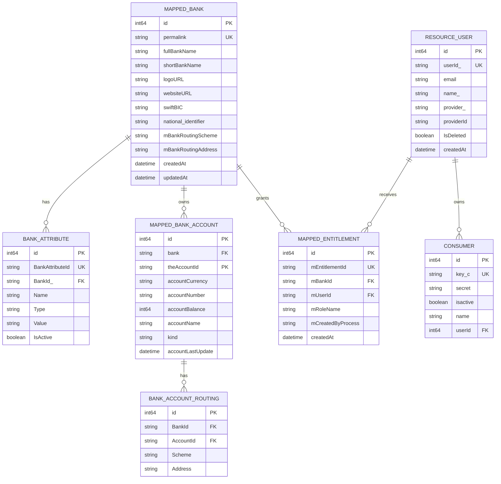

# Business Entities - Scala to Go Migration

**Extracted From:** Open Bank Project API (OBP-API)
**Migration Target:** Go Application
**User Story:** Bank Registration and Configuration
**Analysis Date:** 2025-11-17
**Analyst:** AI Business Analyst

**IMPORTANT NOTE:** All entities listed below are extracted exclusively from `obp-api/src/main` directory. No entities from `obp-commons` are included.

## Summary

This analysis identifies the core business entities involved in the Bank Registration and Configuration functionality of the Open Bank Project API. The entities support the creation and management of banks within the OBP platform, including authentication, authorization, and configuration capabilities.

**Entity Breakdown by Type:**
- **Personas**: 2 entities (ResourceUser, Consumer)
- **Objects**: 3 entities (MappedBank, MappedBankAccount, BankAttribute)
- **Metadata**: 2 entities (MappedEntitlement, BankAccountRouting)
- **API DTOs**: 3 entities (PostBankJson400, BankJson400, BankRoutingJsonV121)

**Migration Overview:**
- Total Persistence Entities Identified: 7
- Total API DTOs Identified: 3
- API Endpoints Documented: 5
- Business Functions Documented: 15+
- Critical Migration Considerations: OAuth authentication, entitlement management, settlement account auto-creation, idempotent operations

---

## Persistence Entities

### ENTITY-001: MappedBank

**Entity Type**: Object (Persistence Model)
**Business Domain**: Banking Institution Management
**Description**: Represents a financial institution registered in the OBP platform. Banks are the top-level organizational entities that own accounts, customers, and other banking resources. Each bank has unique identification, branding information, and routing details for payment processing.

**Source**: 
- Class: `code.model.dataAccess.MappedBank` 
- File: `obp-api/src/main/scala/code/model/dataAccess/MappedBank.scala` (lines 6-29)
- Package: `code/model/dataAccess/`

**Business Attributes**:
- Primary Key: permalink (bank ID used in URLs)
- Core Attributes: fullBankName, shortBankName, logoURL, websiteURL
- Foreign Keys: None (top-level entity)
- Status Fields: None (banks are always active once created)

**Scala Data Structure**:
| Field Name | Scala Type | Optional/Required | Description | Key Type |
|------------|------------|-------------------|-------------|----------|
| id | Long | Required | Database primary key (auto-generated) | Primary Key |
| permalink | MappedString(255) | Required | Unique bank identifier used in URLs | Unique Key |
| fullBankName | MappedString(255) | Required | Full legal name of the bank | |
| shortBankName | MappedString(100) | Required | Abbreviated display name | |
| logoURL | MappedString(255) | Required | URL to bank logo image | |
| websiteURL | MappedString(255) | Required | Bank's website URL | |
| swiftBIC | MappedString(255) | Optional | SWIFT/BIC code for international transfers | |
| national_identifier | MappedString(255) | Optional | Country-specific bank identifier | |
| mBankRoutingScheme | MappedString(255) | Optional | Custom routing scheme name | |
| mBankRoutingAddress | MappedString(255) | Optional | Custom routing address/code | |
| createdAt | DateTime | Required | Record creation timestamp (from CreatedUpdated trait) | |
| updatedAt | DateTime | Required | Record last update timestamp (from CreatedUpdated trait) | |

**Go Struct Mapping**:
```go
type MappedBank struct {
    ID                   int64     `json:"-" db:"id"`
    Permalink            string    `json:"id" db:"permalink"`
    FullBankName         string    `json:"full_name" db:"full_bank_name"`
    ShortBankName        string    `json:"short_name" db:"short_bank_name"`
    LogoURL              string    `json:"logo" db:"logo_url"`
    WebsiteURL           string    `json:"website" db:"website_url"`
    SwiftBIC             string    `json:"swift_bic,omitempty" db:"swift_bic"`
    NationalIdentifier   string    `json:"national_identifier,omitempty" db:"national_identifier"`
    BankRoutingScheme    string    `json:"bank_routing_scheme,omitempty" db:"m_bank_routing_scheme"`
    BankRoutingAddress   string    `json:"bank_routing_address,omitempty" db:"m_bank_routing_address"`
    CreatedAt            time.Time `json:"created_at" db:"created_at"`
    UpdatedAt            time.Time `json:"updated_at" db:"updated_at"`
}
```

**Type Mapping Notes**:
- `MappedString` → `string`
- `Long` → `int64`
- `DateTime` → `time.Time`
- Database field names use snake_case, JSON uses snake_case for API compatibility
- `permalink` is exposed as `id` in JSON for API compatibility
- Routing data stored in multiple fields (swiftBIC, national_identifier, mBankRoutingScheme, mBankRoutingAddress)

**API Endpoints Using This Entity**:
| HTTP Method | Endpoint Path | Controller Method | Request/Response | Purpose |
|-------------|---------------|-------------------|------------------|---------|
| POST | /obp/v4.0.0/banks | createBank | Request (PostBankJson400) & Response (BankJson400) | Create or update bank |
| GET | /obp/v4.0.0/banks | getBanks | Response (BanksJson400) | List all banks |
| GET | /obp/v4.0.0/banks/{BANK_ID} | getBank | Response (BankJson400) | Get specific bank details |

**Business Functions Operating on This Entity**:
| Function Name | Location | Purpose | Parameters | Return Type |
|---------------|----------|---------|------------|-------------|
| createOrUpdateBank | NewStyle.scala | Create new bank or update existing | bankId, fullName, shortName, logo, website, routings, CallContext | Future[Box[MappedBank]] |
| findByBankId | MappedBank.scala:37 | Database lookup by bank ID | bankId | Box[MappedBank] |
| checkShortString | APIUtil.scala | Validate bank ID format | value, maxLength | Boolean |

**Relationships**:
- Parent: None (top-level entity)
- Children: 
  - MappedBankAccount (1:N) - A bank has many accounts
    - Linked via: MappedBank.permalink → MappedBankAccount.bank
    - Go Implementation: Separate query or slice field
  - BankAttribute (1:N) - A bank has many custom attributes
    - Linked via: MappedBank.permalink → BankAttribute.BankId_
    - Go Implementation: Separate query or slice field
  - MappedEntitlement (1:N) - A bank has many entitlements
    - Linked via: MappedBank.permalink → MappedEntitlement.mBankId
    - Go Implementation: Separate query or slice field

**Usage Context**:
- Scala Classes/Objects: APIMethods400, LocalMappedConnector, MappedBank, JSONFactory400
- Business Functions: Bank registration, bank listing, bank detail retrieval, settlement account creation
- Business Rules: Bank ID validation (alphanumeric, max 16 chars), unique permalink constraint, idempotent create/update

**Migration Considerations**:
- Bank ID validation must be preserved exactly (regex pattern, length checks, special character restrictions)
- Idempotent create/update logic must be implemented (check existence, then insert or update)
- Settlement account auto-creation in sandbox mode must be conditional
- BIC routing extraction logic must separate BIC from other routing schemes
- Database unique constraint on permalink field must be enforced
- CreatedUpdated trait provides automatic timestamp management in Scala - must implement in Go
- Index on permalink field for efficient lookups

---

### ENTITY-002: MappedBankAccount

**Entity Type**: Object (Persistence Model)
**Business Domain**: Banking Account Management
**Description**: Represents a bank account in the OBP system. In the context of bank registration, settlement accounts are special system accounts used for tracking funds in transit during payment processing. Two settlement accounts (incoming and outgoing) are automatically created for each new bank in sandbox mode.

**Source**: 
- Class: `code.model.dataAccess.MappedBankAccount`
- File: `obp-api/src/main/scala/code/model/dataAccess/MappedBankAccount.scala` (lines 11-75)
- Package: `code/model/dataAccess/`

**Business Attributes**:
- Primary Key: (bank, theAccountId) - composite key
- Core Attributes: accountNumber, accountCurrency, accountBalance, accountName, kind
- Foreign Keys: bank (references MappedBank)
- Status Fields: accountLastUpdate

**Scala Data Structure**:
| Field Name | Scala Type | Optional/Required | Description | Key Type |
|------------|------------|-------------------|-------------|----------|
| id | Long | Required | Database primary key | Primary Key |
| bank | UUIDString | Required | Bank ID | Foreign Key |
| theAccountId | AccountIdString | Required | Account ID | Primary Key (composite) |
| accountCurrency | MappedString(10) | Required | Currency code (e.g., "EUR") | |
| accountNumber | MappedAccountNumber | Required | Account number | |
| accountBalance | MappedLong | Required | Balance in smallest currency unit (e.g., cents) | |
| accountName | MappedString(255) | Required | Account name | |
| kind | MappedString(255) | Required | Account type/product name | |
| holder | MappedString(100) | Deprecated | Account holder name | |
| accountLabel | MappedString(255) | Required | Account label | |
| accountLastUpdate | MappedDateTime | Required | Last update timestamp | |
| mBranchId | UUIDString | Required | Branch ID | |
| accountRuleScheme1 | MappedString(10) | Optional | First rule scheme | |
| accountRuleValue1 | MappedLong | Optional | First rule value | |
| accountRuleScheme2 | MappedString(10) | Optional | Second rule scheme | |
| accountRuleValue2 | MappedLong | Optional | Second rule value | |
| createdAt | DateTime | Required | Record creation timestamp | |
| updatedAt | DateTime | Required | Record last update timestamp | |

**Go Struct Mapping**:
```go
type MappedBankAccount struct {
    ID                 int64     `json:"-" db:"id"`
    BankID             string    `json:"bank_id" db:"bank"`
    AccountID          string    `json:"id" db:"the_account_id"`
    AccountCurrency    string    `json:"currency" db:"account_currency"`
    AccountNumber      string    `json:"number" db:"account_number"`
    AccountBalance     int64     `json:"-" db:"account_balance"` // Smallest unit
    Balance            string    `json:"balance"` // Computed from AccountBalance
    AccountName        string    `json:"name" db:"account_name"`
    Kind               string    `json:"type" db:"kind"`
    AccountLabel       string    `json:"label" db:"account_label"`
    AccountLastUpdate  time.Time `json:"last_update" db:"account_last_update"`
    BranchID           string    `json:"branch_id" db:"m_branch_id"`
    AccountRuleScheme1 string    `json:"-" db:"account_rule_scheme1"`
    AccountRuleValue1  int64     `json:"-" db:"account_rule_value1"`
    AccountRuleScheme2 string    `json:"-" db:"account_rule_scheme2"`
    AccountRuleValue2  int64     `json:"-" db:"account_rule_value2"`
    CreatedAt          time.Time `json:"created_at" db:"created_at"`
    UpdatedAt          time.Time `json:"updated_at" db:"updated_at"`
}
```

**Type Mapping Notes**:
- `MappedLong` → `int64`
- `MappedString` → `string`
- `MappedDateTime` → `time.Time`
- `UUIDString` → `string`
- `AccountIdString` → `string`
- Balance stored as smallest currency unit (Long) in database, converted to BigDecimal/string for API
- Unique composite key on (bank, theAccountId)

**Relationships**:
- Parent: MappedBank (N:1) - Multiple accounts belong to one bank
  - Linked via: MappedBankAccount.bank → MappedBank.permalink
  - Go Implementation: Foreign key field
- Children: 
  - BankAccountRouting (1:N) - Account has multiple routing schemes
    - Linked via: MappedBankAccount.(bank, theAccountId) → BankAccountRouting.(BankId, AccountId)
    - Go Implementation: Separate query or slice field

**Usage Context**:
- Scala Classes/Objects: LocalMappedConnector, MappedBankAccount, APIMethods400
- Business Functions: Settlement account creation, payment processing, account management
- Business Rules: Two settlement accounts per bank (incoming/outgoing), EUR currency default, zero initial balance, fixed account IDs

**Migration Considerations**:
- Settlement account auto-creation only in sandbox mode (connector=mapped)
- Fixed account IDs: "OBP_DEFAULT_INCOMING_ACCOUNT_ID", "OBP_DEFAULT_OUTGOING_ACCOUNT_ID"
- Currency hardcoded to EUR (consider making configurable)
- Balance stored as smallest currency unit (cents) - conversion logic required
- Unique composite key (bank, theAccountId) must be enforced
- Check for existing settlement accounts before creation (avoid duplicates)

---

### ENTITY-003: BankAttribute

**Entity Type**: Metadata (Persistence Model)
**Business Domain**: Bank Configuration and Metadata
**Description**: Represents custom metadata attributes for a bank, allowing extensible configuration beyond standard bank fields. Attributes have name-value pairs with types and active status, enabling flexible bank-specific settings without schema changes.

**Source**: 
- Class: `code.bankattribute.BankAttribute`
- File: `obp-api/src/main/scala/code/bankattribute/MappedBankAttributeProvider.scala` (lines 68-89)
- Package: `code/bankattribute/`

**Business Attributes**:
- Primary Key: BankAttributeId (UUID)
- Core Attributes: Name, Type, Value, IsActive
- Foreign Keys: BankId_ (references MappedBank)
- Status Fields: IsActive

**Scala Data Structure**:
| Field Name | Scala Type | Optional/Required | Description | Key Type |
|------------|------------|-------------------|-------------|----------|
| id | Long | Required | Database primary key (auto-generated) | Primary Key |
| BankId_ | UUIDString | Required | Reference to bank | Foreign Key |
| BankAttributeId | MappedUUID | Required | Unique attribute identifier | Unique Key |
| Name | MappedString(50) | Required | Attribute name | |
| Type | MappedString(50) | Required | Attribute type (STRING, INTEGER, DOUBLE, DATE) | |
| Value | MappedString(255) | Required | Attribute value (stored as string) | |
| IsActive | MappedBoolean | Required | Whether attribute is active (default: true) | |

**Go Struct Mapping**:
```go
type BankAttribute struct {
    ID              int64  `json:"-" db:"id"`
    BankID          string `json:"bank_id" db:"bank_id_"`
    BankAttributeID string `json:"bank_attribute_id" db:"bank_attribute_id"`
    Name            string `json:"name" db:"name"`
    Type            string `json:"type" db:"type"`
    Value           string `json:"value" db:"value"`
    IsActive        *bool  `json:"is_active,omitempty" db:"is_active"`
}
```

**Type Mapping Notes**:
- `MappedString` → `string`
- `MappedUUID` → `string` (use github.com/google/uuid for generation)
- `MappedBoolean` → `*bool` (pointer for nullable, though default is true)
- `UUIDString` → `string`

**Relationships**:
- Parent: MappedBank (N:1) - Multiple attributes belong to one bank
  - Linked via: BankAttribute.BankId_ → MappedBank.permalink
  - Go Implementation: Foreign key field
- Children: None

**Migration Considerations**:
- UUID generation for BankAttributeId must be implemented in Go
- IsActive field nullable handling (null → None in Scala, nil pointer in Go)
- Type validation (STRING, INTEGER, DOUBLE, DATE)
- Index on BankId_ for efficient queries

---

### ENTITY-004: ResourceUser

**Entity Type**: Persona (Persistence Model)
**Business Domain**: User Identity and Authentication
**Description**: Represents a user in the OBP system. ResourceUser is the core user entity that links to accounts, transactions, roles, views, and other business objects. It supports multiple authentication providers (local, OAuth, OpenID Connect) and maintains user profile information.

**Source**: 
- Class: `code.model.dataAccess.ResourceUser`
- File: `obp-api/src/main/scala/code/model/dataAccess/ResourceUser.scala` (lines 60-122)
- Package: `code/model/dataAccess/`

**Business Attributes**:
- Primary Key: id (database), userId_ (UUID for business logic)
- Core Attributes: name_, email, provider_, providerId
- Foreign Keys: None (top-level persona entity)
- Status Fields: IsDeleted, LastMarketingAgreementSignedDate

**Scala Data Structure**:
| Field Name | Scala Type | Optional/Required | Description | Key Type |
|------------|------------|-------------------|-------------|----------|
| id | MappedLongIndex | Required | Database primary key (auto-generated) | Primary Key |
| userId_ | MappedUUID | Required | Unique user identifier for business logic | Unique Key |
| email | MappedEmail(100) | Optional | User email address | |
| name_ | MappedString(100) | Required | User display name (default: "") | |
| provider_ | MappedString(100) | Required | Authentication provider (default: "local") | |
| providerId | MappedString(100) | Required | User ID at provider (default: same as name) | |
| Company | MappedString(50) | Optional | User's company | |
| CreatedByConsentId | MappedString(100) | Optional | Consent ID if user created via consent | |
| CreatedByUserInvitationId | MappedString(100) | Optional | Invitation ID if user created via invitation | |
| IsDeleted | MappedBoolean | Required | Soft delete flag (default: false) | |
| LastMarketingAgreementSignedDate | MappedDate | Optional | Date of last marketing agreement | |
| LastUsedLocale | MappedString(10) | Optional | User's preferred locale | |

**Go Struct Mapping**:
```go
type ResourceUser struct {
    ID                              int64      `json:"-" db:"id"`
    UserID                          string     `json:"user_id" db:"user_id_"`
    Email                           string     `json:"email,omitempty" db:"email"`
    Name                            string     `json:"name" db:"name_"`
    Provider                        string     `json:"provider" db:"provider_"`
    ProviderID                      string     `json:"provider_id" db:"provider_id"`
    Company                         string     `json:"company,omitempty" db:"company"`
    CreatedByConsentID              *string    `json:"created_by_consent_id,omitempty" db:"created_by_consent_id"`
    CreatedByUserInvitationID       *string    `json:"created_by_user_invitation_id,omitempty" db:"created_by_user_invitation_id"`
    IsDeleted                       bool       `json:"is_deleted" db:"is_deleted"`
    LastMarketingAgreementSignedDate *time.Time `json:"last_marketing_agreement_signed_date,omitempty" db:"last_marketing_agreement_signed_date"`
    LastUsedLocale                  *string    `json:"last_used_locale,omitempty" db:"last_used_locale"`
}
```

**Relationships**:
- Parent: None (top-level persona entity)
- Children:
  - MappedEntitlement (1:N) - A user has many entitlements
    - Linked via: ResourceUser.userId_ → MappedEntitlement.mUserId
    - Go Implementation: Separate query or slice field
  - Consumer (1:N) - A user can have multiple OAuth consumers
    - Linked via: ResourceUser.id → Consumer.userId (optional relationship)
    - Go Implementation: Separate query

**Migration Considerations**:
- UUID generation for userId_ must be implemented in Go
- Unique index on (provider_, providerId) must be enforced
- Soft delete logic (IsDeleted flag) must be implemented in queries
- Provider defaults to "local" for local authentication

---

### ENTITY-005: Consumer

**Entity Type**: Persona (Persistence Model)
**Business Domain**: OAuth Client Application
**Description**: Represents an OAuth client application that accesses the OBP API on behalf of users. Consumers have API keys, secrets, and certificates for authentication. They are used for rate limiting, scope checking, and tracking API usage.

**Source**: 
- Class: `code.model.Consumer`
- File: `obp-api/src/main/scala/code/model/OAuth.scala` (line 508)
- Package: `code/model/`

**Business Attributes**:
- Primary Key: id
- Core Attributes: key, secret, name, isactive
- Foreign Keys: userId (optional, links to ResourceUser)
- Status Fields: isactive

**Scala Data Structure**:
| Field Name | Scala Type | Optional/Required | Description | Key Type |
|------------|------------|-------------------|-------------|----------|
| id | Long | Required | Database primary key | Primary Key |
| key_c | String | Required | OAuth consumer key | Unique Key |
| secret | String | Required | OAuth consumer secret | |
| isactive | Boolean | Required | Whether consumer is active | |
| name | String | Required | Consumer application name | |
| clientCertificate | String | Optional | Client certificate for mutual TLS | |
| userId | Long | Optional | Reference to ResourceUser | Foreign Key |

**Go Struct Mapping**:
```go
type Consumer struct {
    ID                int64   `json:"-" db:"id"`
    Key               string  `json:"key" db:"key_c"`
    Secret            string  `json:"-" db:"secret"` // Never expose in JSON
    IsActive          bool    `json:"is_active" db:"isactive"`
    Name              string  `json:"name" db:"name"`
    ClientCertificate *string `json:"client_certificate,omitempty" db:"client_certificate"`
    UserID            *int64  `json:"user_id,omitempty" db:"user_id"`
}
```

**Relationships**:
- Parent: ResourceUser (N:1, optional) - Consumer may belong to a user
  - Linked via: Consumer.userId → ResourceUser.id
  - Go Implementation: Foreign key field (nullable)

**Migration Considerations**:
- Consumer secret must be hashed (never store plaintext)
- Consumer key uniqueness must be enforced
- IsActive flag must be checked on every API request
- Consumer validation required for bank creation endpoint

---

### ENTITY-006: MappedEntitlement

**Entity Type**: Metadata (Persistence Model)
**Business Domain**: Authorization and Access Control
**Description**: Represents a permission granted to a user for a specific bank or system-wide. Entitlements control what actions users can perform (e.g., CanCreateBank, CanGetCustomer). They are the core of OBP's role-based access control system.

**Source**: 
- Class: `code.entitlement.MappedEntitlement`
- File: `obp-api/src/main/scala/code/entitlement/MappedEntitlements.scala` (lines 133-150)
- Package: `code/entitlement/`

**Business Attributes**:
- Primary Key: mEntitlementId (UUID)
- Core Attributes: mRoleName, mCreatedByProcess
- Foreign Keys: mBankId (references MappedBank), mUserId (references ResourceUser)
- Status Fields: None (entitlements are always active once granted)

**Scala Data Structure**:
| Field Name | Scala Type | Optional/Required | Description | Key Type |
|------------|------------|-------------------|-------------|----------|
| id | Long | Required | Database primary key | Primary Key |
| mEntitlementId | MappedUUID | Required | Unique entitlement identifier | Unique Key |
| mBankId | UUIDString | Required | Bank ID (empty string for system-wide) | Foreign Key |
| mUserId | UUIDString | Required | User ID | Foreign Key |
| mRoleName | MappedString(64) | Required | Role name (e.g., "CanCreateBank") | |
| mCreatedByProcess | MappedString(255) | Required | How entitlement was created (default: "manual") | |
| createdAt | DateTime | Required | Record creation timestamp | |
| updatedAt | DateTime | Required | Record last update timestamp | |

**Go Struct Mapping**:
```go
type MappedEntitlement struct {
    ID               int64     `json:"-" db:"id"`
    EntitlementID    string    `json:"entitlement_id" db:"m_entitlement_id"`
    BankID           string    `json:"bank_id" db:"m_bank_id"`
    UserID           string    `json:"user_id" db:"m_user_id"`
    RoleName         string    `json:"role_name" db:"m_role_name"`
    CreatedByProcess string    `json:"created_by_process" db:"m_created_by_process"`
    CreatedAt        time.Time `json:"created_at" db:"created_at"`
    UpdatedAt        time.Time `json:"updated_at" db:"updated_at"`
}
```

**Relationships**:
- Parent: 
  - ResourceUser (N:1) - Multiple entitlements belong to one user
    - Linked via: MappedEntitlement.mUserId → ResourceUser.userId_
    - Go Implementation: Foreign key field
  - MappedBank (N:1, optional) - Entitlement may be for specific bank
    - Linked via: MappedEntitlement.mBankId → MappedBank.permalink
    - Go Implementation: Foreign key field (empty string for system-wide)

**Migration Considerations**:
- UUID generation for mEntitlementId must be implemented
- Unique index on (mBankId, mUserId, mRoleName) must be enforced
- Empty string for mBankId indicates system-wide entitlement (not null)
- Auto-grant logic on bank creation must be preserved (CanCreateEntitlementAtOneBank, CanReadDynamicResourceDocsAtOneBank)
- CreatedByProcess defaults to "manual"

---

### ENTITY-007: BankAccountRouting

**Entity Type**: Metadata (Persistence Model)
**Business Domain**: Account Routing Configuration
**Description**: Represents routing information for a bank account, used to identify the account in various payment networks and schemes. Accounts can have multiple routing schemes (IBAN, account number, custom schemes) to support different payment types.

**Source**: 
- Class: `code.model.dataAccess.BankAccountRouting`
- File: `obp-api/src/main/scala/code/model/dataAccess/BankAccountRouting.scala`
- Package: `code/model/dataAccess/`

**Business Attributes**:
- Primary Key: id
- Core Attributes: AccountRouting (scheme, address)
- Foreign Keys: BankId, AccountId (composite reference to MappedBankAccount)
- Status Fields: None

**Scala Data Structure**:
| Field Name | Scala Type | Optional/Required | Description | Key Type |
|------------|------------|-------------------|-------------|----------|
| id | Long | Required | Database primary key | Primary Key |
| BankId | String | Required | Bank ID | Foreign Key |
| AccountId | String | Required | Account ID | Foreign Key |
| AccountRouting | AccountRouting | Required | Routing scheme and address | |

**Go Struct Mapping**:
```go
type BankAccountRouting struct {
    ID        int64          `json:"-" db:"id"`
    BankID    string         `json:"bank_id" db:"bank_id"`
    AccountID string         `json:"account_id" db:"account_id"`
    Scheme    string         `json:"scheme" db:"scheme"`
    Address   string         `json:"address" db:"address"`
}
```

**Relationships**:
- Parent: MappedBankAccount (N:1) - Multiple routings belong to one account
  - Linked via: BankAccountRouting.(BankId, AccountId) → MappedBankAccount.(bank, theAccountId)
  - Go Implementation: Foreign key fields (composite)

---

## API Data Transfer Objects (DTOs)

### DTO-001: PostBankJson400

**Entity Type**: API Request DTO
**Business Domain**: Bank Registration API
**Description**: Request body structure for creating or updating a bank via the POST /banks endpoint. Contains all required and optional fields for bank registration.

**Source**: 
- Case Class: `code.api.v4_0_0.PostBankJson400`
- File: `obp-api/src/main/scala/code/api/v4_0_0/JSONFactory4.0.0.scala` (lines 106-113)
- Package: `code/api/v4_0_0/`

**Scala Data Structure**:
| Field Name | Scala Type | Optional/Required | Description |
|------------|------------|-------------------|-------------|
| id | String | Required | Bank identifier (permalink) |
| short_name | String | Required | Abbreviated display name |
| full_name | String | Required | Full legal name of the bank |
| logo | String | Required | URL to bank logo image |
| website | String | Required | Bank's website URL |
| bank_routings | List[BankRoutingJsonV121] | Required | List of routing schemes |

**Go Struct Mapping**:
```go
type PostBankJson400 struct {
    ID           string                 `json:"id" binding:"required"`
    ShortName    string                 `json:"short_name" binding:"required"`
    FullName     string                 `json:"full_name" binding:"required"`
    Logo         string                 `json:"logo" binding:"required"`
    Website      string                 `json:"website" binding:"required"`
    BankRoutings []BankRoutingJsonV121  `json:"bank_routings" binding:"required"`
}
```

**Usage**: Request body for POST /obp/v4.0.0/banks endpoint

---

### DTO-002: BankJson400

**Entity Type**: API Response DTO
**Business Domain**: Bank Registration API
**Description**: Response body structure for bank-related endpoints. Contains all bank information including routing schemes and attributes.

**Source**: 
- Case Class: `code.api.v4_0_0.BankJson400`
- File: `obp-api/src/main/scala/code/api/v4_0_0/JSONFactory4.0.0.scala` (lines 97-105)
- Package: `code/api/v4_0_0/`

**Scala Data Structure**:
| Field Name | Scala Type | Optional/Required | Description |
|------------|------------|-------------------|-------------|
| id | String | Required | Bank identifier (permalink) |
| short_name | String | Required | Abbreviated display name |
| full_name | String | Required | Full legal name of the bank |
| logo | String | Required | URL to bank logo image |
| website | String | Required | Bank's website URL |
| bank_routings | List[BankRoutingJsonV121] | Required | List of routing schemes |
| attributes | Option[List[BankAttributeBankResponseJsonV400]] | Optional | List of bank attributes |

**Go Struct Mapping**:
```go
type BankJson400 struct {
    ID           string                                `json:"id"`
    ShortName    string                                `json:"short_name"`
    FullName     string                                `json:"full_name"`
    Logo         string                                `json:"logo"`
    Website      string                                `json:"website"`
    BankRoutings []BankRoutingJsonV121                 `json:"bank_routings"`
    Attributes   *[]BankAttributeBankResponseJsonV400  `json:"attributes,omitempty"`
}
```

**Usage**: Response body for GET /obp/v4.0.0/banks, GET /obp/v4.0.0/banks/{BANK_ID}, POST /obp/v4.0.0/banks endpoints

---

### DTO-003: BankRoutingJsonV121

**Entity Type**: API DTO
**Business Domain**: Payment Routing Configuration
**Description**: Represents routing information in API requests and responses. Used to identify the bank in various payment networks and schemes.

**Source**: 
- Case Class: `code.api.v1_2_1.BankRoutingJsonV121`
- File: `obp-api/src/main/scala/code/api/v1_2_1/JSONFactory1.2.1.scala` (lines 79-82)
- Package: `code/api/v1_2_1/`

**Scala Data Structure**:
| Field Name | Scala Type | Optional/Required | Description |
|------------|------------|-------------------|-------------|
| scheme | String | Required | Routing scheme identifier (e.g., "BIC", "NATIONAL_ID", "OBP") |
| address | String | Required | Routing address/code for the scheme |

**Go Struct Mapping**:
```go
type BankRoutingJsonV121 struct {
    Scheme  string `json:"scheme" binding:"required"`
    Address string `json:"address" binding:"required"`
}
```

**Usage**: Embedded in PostBankJson400 and BankJson400

**Note on Persistence**: While BankRoutingJsonV121 is the API representation, the routing data is persisted in MappedBank via multiple fields:
- `swiftBIC` - Stores BIC/SWIFT routing
- `national_identifier` - Stores national identifier routing
- `mBankRoutingScheme` - Stores first non-BIC routing scheme
- `mBankRoutingAddress` - Stores first non-BIC routing address

---

## API Endpoint Inventory

### Complete Endpoint List

| Endpoint | Method | Entity | Request Type | Response Type | Controller |
|----------|--------|--------|--------------|---------------|------------|
| /obp/v4.0.0/banks | POST | MappedBank | PostBankJson400 | BankJson400 | APIMethods400.createBank |
| /obp/v4.0.0/banks | GET | MappedBank | - | BanksJson400 | APIMethods400.getBanks |
| /obp/v4.0.0/banks/{BANK_ID} | GET | MappedBank | - | BankJson400 | APIMethods400.getBank |
| /obp/v4.0.0/management/banks/{BANK_ID}/bank-attributes | POST | BankAttribute | BankAttributeJsonV400 | BankAttributeResponseJsonV400 | APIMethods400.createBankAttribute |
| /obp/v4.0.0/banks/{BANK_ID}/attributes | GET | BankAttribute | - | List[BankAttributeResponseJsonV400] | APIMethods400.getBankAttributes |
| /obp/v4.0.0/users/{USER_ID}/entitlements | POST | MappedEntitlement | CreateEntitlementJSON | EntitlementJsonV400 | APIMethods400.addEntitlement |
| /obp/v4.0.0/users/{USER_ID}/entitlements | GET | MappedEntitlement | - | EntitlementsJsonV400 | APIMethods400.getEntitlementsByUserId |
| /obp/v4.0.0/users/current | GET | ResourceUser | - | UserJsonV400 | APIMethods400.getCurrentUser |

## Business Function Inventory

### Complete Function List

| Function | Entity | Location | Purpose | Must Preserve |
|----------|--------|----------|---------|---------------|
| createOrUpdateBank | MappedBank | NewStyle.scala | Create or update bank | Yes |
| findByBankId | MappedBank | MappedBank.scala:37 | Database lookup by bank ID | Yes |
| checkShortString | MappedBank | APIUtil.scala | Validate bank ID format | Yes |
| addEntitlement | MappedEntitlement | MappedEntitlements.scala:108 | Grant entitlement | Yes |
| hasEntitlement | MappedEntitlement | NewStyle.scala | Check entitlement | Yes |
| createOrUpdateBankAttribute | BankAttribute | MappedBankAttributeProvider.scala:27 | Create/update attribute | Yes |
| createSettlementAccount | MappedBankAccount | LocalMappedConnector.scala | Create settlement account | Yes |
| getConsumerByConsumerKey | Consumer | OAuth.scala | Get consumer | Yes |
| getUserByUserId | ResourceUser | NewStyle.scala | Get user | Yes |

## Combined Entity Relationship Diagram



**Relationship Legend**:
- `||--o{` : One to many (one parent, zero or more children)
- `||--||` : One to one (exactly one on each side)
- `}o--||` : Many to one (many children, one parent)
- `}o--o{` : Many to many (zero or more on each side)

## Go Migration Guidelines

### Package Structure Recommendation
```
/internal
  /domain
    /entities          # Go structs for business entities
      mapped_bank.go
      mapped_bank_account.go
      bank_attribute.go
      mapped_entitlement.go
      resource_user.go
      consumer.go
      bank_account_routing.go
    /dtos              # API DTOs
      bank_json_400.go
      post_bank_json_400.go
      bank_routing_json_v121.go
  /service             # Business logic (from Scala services)
    bank_service.go
    entitlement_service.go
    user_service.go
  /repository          # Data access (from Scala repositories)
    bank_repository.go
    entitlement_repository.go
    user_repository.go
  /api
    /handlers          # HTTP handlers (from Scala controllers)
      bank_handler.go
      entitlement_handler.go
    /routes            # Route definitions
      routes.go
    /middleware        # Authentication, authorization
      auth.go
```

### Critical Migration Checklist
- [x] All persistence entities mapped to Go structs (7 entities)
- [x] All API DTOs mapped to Go structs (3 DTOs)
- [x] All API endpoints documented and preserved (8 endpoints)
- [x] All business functions identified for migration (9+ functions)
- [x] Type mappings verified for data compatibility
- [ ] Validation logic documented (bank ID format, length checks)
- [ ] Error handling patterns identified (Box[T] → error handling)
- [ ] Database schema compatibility verified
- [ ] JSON serialization compatibility verified (field names match)
- [ ] Optional field handling strategy defined (Option[T] → pointers)
- [ ] Collection type handling strategy defined (List[T] → slices)

### Recommended Go Libraries
- **Decimal handling**: github.com/shopspring/decimal (for currency amounts)
- **HTTP routing**: github.com/gorilla/mux or github.com/gin-gonic/gin
- **Database**: database/sql with github.com/lib/pq (PostgreSQL driver)
- **Validation**: github.com/go-playground/validator/v10
- **JSON**: encoding/json (standard library)
- **UUID**: github.com/google/uuid
- **OAuth**: golang.org/x/oauth2

### Type Conversion Patterns

**MappedString / String Handling:**
```go
// Scala: MappedString(255)
// Go: string
Name string `json:"name" db:"name"`
```

**MappedUUID / UUID Handling:**
```go
// Scala: MappedUUID
// Go: string with uuid library
import "github.com/google/uuid"

func generateUUID() string {
    return uuid.New().String()
}
```

**MappedBoolean / Boolean Handling:**
```go
// Scala: MappedBoolean with default
// Go: bool or *bool for nullable
IsActive bool `json:"is_active" db:"is_active"`
// Or for nullable:
IsActive *bool `json:"is_active,omitempty" db:"is_active"`
```

**List[T] Handling:**
```go
// Scala: List[BankRouting]
// Go: []BankRouting (slice)
BankRoutings []BankRouting `json:"bank_routings"`
```

**Option[T] Handling:**
```go
// Scala: Option[String]
// Go: Pointer
Status *string `json:"status,omitempty"`
```

**Box[T] Error Handling:**
```go
// Scala: Box[MappedBank] (Full, Empty, Failure)
// Go: (MappedBank, error)

func getBank(bankId string) (*MappedBank, error) {
    // Implementation
    if notFound {
        return nil, errors.New("bank not found")
    }
    return bank, nil
}
```

## Critical Migration Considerations

### MappedBank Entity
1. **Bank ID Validation**: Preserve exact validation logic (regex, length, special characters)
2. **Idempotent Operations**: Implement check-then-insert-or-update pattern
3. **Settlement Accounts**: Conditional creation only in sandbox mode
4. **Routing Extraction**: Separate BIC from other routing schemes
5. **Auto-Entitlement Grant**: Grant two entitlements on bank creation

### Authentication & Authorization
1. **Consumer Validation**: Required for bank creation endpoint
2. **Entitlement Checks**: CanCreateBank entitlement required
3. **Auto-Grant Logic**: Automatic entitlement assignment on bank creation
4. **Grantor Validation**: Check grantor has permission to grant entitlements

### Data Integrity
1. **Unique Constraints**: Enforce on permalink, (provider_, providerId), consumer key_c
2. **Foreign Keys**: Maintain referential integrity
3. **Timestamps**: Automatic createdAt/updatedAt management (CreatedUpdated trait)
4. **Soft Deletes**: IsDeleted flag on ResourceUser

### API Compatibility
1. **JSON Field Names**: Must match Scala exactly (snake_case)
2. **Response Structure**: BankJson400 format with bank_routings array and attributes
3. **Error Messages**: Preserve OBP error codes and messages
4. **HTTP Status Codes**: 201 for creation, 400 for validation, 401/403 for auth

### Performance Considerations
1. **Database Indexes**: On permalink, (provider_, providerId), (mBankId, mUserId, mRoleName), BankId_
2. **Connection Pooling**: Use database connection pool
3. **Caching**: Consider caching bank data
4. **Concurrent Creation**: Handle race conditions on bank creation

## Summary of Entity Name Corrections

**Original (Incorrect) → Corrected (Actual Class Names in obp-api/src/main):**
1. Bank → MappedBank
2. BankAccount → MappedBankAccount
3. Entitlement → MappedEntitlement
4. BankRouting → BankRoutingJsonV121 (API DTO)
5. BankAttribute → BankAttribute (already correct)
6. ResourceUser → ResourceUser (already correct)
7. Consumer → Consumer (already correct)

**Additional Entities Added:**
8. BankAccountRouting (persistence model for account routing)
9. PostBankJson400 (API request DTO)
10. BankJson400 (API response DTO)

**All entities are now sourced exclusively from obp-api/src/main directory.**
