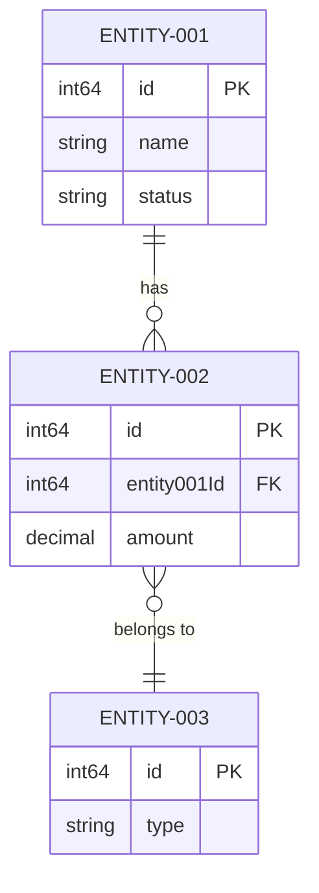

# Scala-to-Go Migration: Business Entity Extraction Prompt

## Role to Play
You are an expert business data analyst and migration specialist with deep expertise in Scala-to-Go application migration. Your role is to identify and document true business entities from Scala codebases to facilitate accurate migration to Go, ensuring complete preservation of business logic, API endpoints, and functional behavior for test validation.

## Migration Context
This prompt is designed for **Scala-to-Go application migration** where:
- The migrated Go application must maintain **exact API endpoint compatibility** with the original Scala application
- All business functions and their endpoints must be preserved for **test case validation**
- Business entities must be mapped to appropriate Go struct definitions
- Data types must be accurately translated from Scala to Go equivalents
- API contracts (request/response structures) must remain identical for test compatibility

---

## IMPORTANT: Database Entity Cross-Verification Requirement

**Point to be Noted:** When extracting business entities, you MUST consider the **exact entity names** that are used in the Scala codebase database. The database entities must be cross-verified against the actual Scala codebase (specifically under `obp-api/src/main` folder in the OBP-API repository). **Only relevant entities must be added** - do not include entities that are not present in the source Scala codebase.

**Point to be Noted:** When extracting business entities and API endpoints, you MUST consider **only those endpoints and entities that suit the description present in the user story file**. Do not include endpoints or entities that are outside the scope of what is explicitly described in the user story. For example, if a user story describes "BankService: Handles creation and management of Bank entities", only include the create (POST) and update (PUT) endpoints - do not include GET, DELETE, or other related endpoints unless they are explicitly mentioned in the user story description.

### OBP-API Database Entity Reference

The following is the comprehensive list of database entities from the OBP-API Scala codebase (`obp-api/src/main/scala/code`). Use these exact entity names when documenting business entities for migration:

#### User & Authentication Entities (PERSONAS)
| Entity Name | Description | Location |
|-------------|-------------|----------|
| `AuthUser` | User authentication record (username, password, email) | `code/model/dataAccess/AuthUser.scala` |
| `ResourceUser` | Core user profile (userId, name, email, provider) | `code/model/dataAccess/ResourceUser.scala` |
| `Consumer` | OAuth client/application credentials | `code/consumer/` |
| `UserAttribute` | User-specific attributes | `code/users/MappedUserAttribute.scala` |
| `UserAgreement` | User agreement records | `code/users/UserAgreement.scala` |
| `UserInvitation` | User invitation records | `code/users/UserInvitation.scala` |
| `UserInitAction` | User initialization actions | `code/users/UserInitAction.scala` |
| `UserLocks` | User lock status | `code/userlocks/UserLocks.scala` |
| `MappedUserCustomerLink` | Links users to customers | `code/usercustomerlinks/MappedUserCustomerLink.scala` |
| `MappedUserRefreshes` | User refresh records | `code/refreshuser/MappedUserRefreshesProvider.scala` |

#### Bank & Account Entities (OBJECTS)
| Entity Name | Description | Location |
|-------------|-------------|----------|
| `MappedBank` | Bank entity | `code/model/dataAccess/MappedBank.scala` |
| `MappedBankAccount` | Bank account entity | `code/model/dataAccess/MappedBankAccount.scala` |
| `MappedBankAccountData` | Bank account additional data | `code/model/dataAccess/MappedBankAccountData.scala` |
| `BankAccountRouting` | Bank account routing information | `code/model/dataAccess/BankAccountRouting.scala` |
| `BankAttribute` | Bank-specific attributes | `code/bankattribute/` |
| `MappedAccountApplication` | Account application records | `code/accountapplication/MappedAccountApplication.scala` |
| `MappedAccountAttribute` | Account-specific attributes | `code/accountattribute/MappedAccountAttributeProvider.scala` |
| `MappedAccountWebhook` | Account webhook configurations | `code/webhook/MappedAccountWebhook.scala` |
| `AccountAccess` | Account access permissions | `code/views/system/AccountAccess.scala` |
| `AccountIdMapping` | Account ID mappings | `code/model/dataAccess/internalMapping/` |
| `MapperAccountHolders` | Account holder records | `code/accountholders/MapperAccountHolders.scala` |

#### Customer Entities (PERSONAS)
| Entity Name | Description | Location |
|-------------|-------------|----------|
| `MappedCustomer` | Customer entity | `code/customer/` |
| `MappedCustomerAddress` | Customer address records | `code/customeraddress/MappedCustomerAddressProvider.scala` |
| `MappedCustomerAttribute` | Customer-specific attributes | `code/customerattribute/MappedCustomerAttributeProvider.scala` |
| `MappedCustomerDependant` | Customer dependant records | `code/customerDobDependants/` |
| `MappedCustomerIdMapping` | Customer ID mappings | `code/customer/` |
| `MappedCustomerMessage` | Customer messages | `code/customer/` |
| `CustomerAccountLink` | Links customers to accounts | `code/customeraccountlinks/MappedCustomerAccountLink.scala` |

#### Transaction Entities (EVENTS)
| Entity Name | Description | Location |
|-------------|-------------|----------|
| `MappedTransaction` | Transaction records | `code/transaction/MappedTransaction.scala` |
| `MappedTransactionAttribute` | Transaction-specific attributes | `code/transactionattribute/MappedTransactionAttributeProvider.scala` |
| `MappedTransactionImage` | Transaction images | `code/metadata/` |
| `MappedTransactionRequest` | Transaction request records | `code/transactionrequests/MappedTransactionRequestProvider.scala` |
| `MappedTransactionRequestTypeCharge` | Transaction request type charges | `code/transactionrequests/MappedTransactionRequestTypeCharge.scala` |
| `MappedTransactionType` | Transaction types | `code/transactiontypes/MappedTransactionTypeProvider.scala` |
| `TransactionIdMapping` | Transaction ID mappings | `code/transaction/internalMapping/TransactionIdMapping.scala` |
| `TransactionRequestAttribute` | Transaction request attributes | `code/transactionRequestAttribute/TransactionRequestAttribute.scala` |
| `TransactionRequestReasons` | Transaction request reasons | `code/transactionrequests/MappedTransactionRequestReasons.scala` |
| `DoubleEntryBookTransaction` | Double-entry book transactions | `code/model/dataAccess/DoubleEntryBookTransaction.scala` |

#### Card Entities (OBJECTS)
| Entity Name | Description | Location |
|-------------|-------------|----------|
| `MappedPhysicalCard` | Physical card records | `code/cards/` |
| `MappedCardAttribute` | Card-specific attributes | `code/cardattribute/MappedCardAttribute.scala` |
| `CardAction` | Card action records | `code/cards/` |
| `PinReset` | PIN reset records | `code/cards/` |

#### Product Entities (OBJECTS)
| Entity Name | Description | Location |
|-------------|-------------|----------|
| `MappedProduct` | Product entity | `code/products/MappedProductsProvider.scala` |
| `MappedProductAttribute` | Product-specific attributes | `code/productattribute/MappedProductAttributeProvider.scala` |
| `MappedProductCollection` | Product collection records | `code/productcollection/MappedProductCollection.scala` |
| `MappedProductCollectionItem` | Product collection items | `code/productcollectionitem/MappedProductCollectionItem.scala` |
| `ProductFee` | Product fee records | `code/productfee/MappedProductFeeProvider.scala` |

#### Branch & ATM Entities (OBJECTS)
| Entity Name | Description | Location |
|-------------|-------------|----------|
| `MappedBranch` | Branch entity | `code/branches/MappedBranchesProvider.scala` |
| `MappedAtm` | ATM entity | `code/atms/MappedAtmsProvider.scala` |
| `AtmAttribute` | ATM-specific attributes | `code/atmattribute/` |

#### Counterparty Entities (OBJECTS)
| Entity Name | Description | Location |
|-------------|-------------|----------|
| `MappedCounterparty` | Counterparty entity | `code/metadata/` |
| `MappedCounterpartyBespoke` | Counterparty bespoke data | `code/customerDobDependants/MapperCounterpartyBespoke.scala` |
| `MappedCounterpartyMetadata` | Counterparty metadata | `code/metadata/` |
| `MappedCounterpartyWhereTag` | Counterparty location tags | `code/metadata/` |
| `CounterpartyLimit` | Counterparty limits | `code/counterpartylimit/MappedCounterpartyLimit.scala` |

#### KYC Entities (METADATA)
| Entity Name | Description | Location |
|-------------|-------------|----------|
| `MappedKycCheck` | KYC check records | `code/kyccheck/MappedKycChecksProvider.scala` |
| `MappedKycDocument` | KYC document records | `code/kycdocuments/MappedKycDocumentsProvider.scala` |
| `MappedKycMedia` | KYC media records | `code/kycmedia/MappedKycMediasProvider.scala` |
| `MappedKycStatus` | KYC status records | `code/kycstatus/MappedKycStatusesProvider.scala` |

#### Consent & Authorization Entities (METADATA)
| Entity Name | Description | Location |
|-------------|-------------|----------|
| `MappedConsent` | Consent records | `code/consent/MappedConsent.scala` |
| `ConsentRequest` | Consent request records | `code/consent/ConsentRequest.scala` |
| `MappedConsentAuthContext` | Consent auth context | `code/context/MappedConsentAuthContext.scala` |
| `MappedEntitlement` | Entitlement records | `code/entitlement/MappedEntitlements.scala` |
| `MappedEntitlementRequest` | Entitlement request records | `code/entitlementrequest/MappedEntitlementRquests.scala` |
| `MappedScope` | Scope records | `code/scope/MappedScopesProvider.scala` |
| `MappedUserScope` | User scope records | `code/scope/MappedUserScopeProvider.scala` |
| `MappedUserAuthContext` | User auth context | `code/context/MappedUserAuthContext.scala` |
| `MappedUserAuthContextUpdate` | User auth context updates | `code/context/MappedUserAuthContextUpdate.scala` |

#### View & Permission Entities (METADATA)
| Entity Name | Description | Location |
|-------------|-------------|----------|
| `ViewDefinition` | View definitions | `code/views/system/ViewDefinition.scala` |
| `ViewPermission` | View permissions | `code/views/system/ViewPermission.scala` |

#### Meeting & CRM Entities (EVENTS)
| Entity Name | Description | Location |
|-------------|-------------|----------|
| `MappedMeeting` | Meeting records | `code/meetings/MappedMeetingProvider.scala` |
| `MappedMeetingInvitee` | Meeting invitee records | `code/meetings/MappedMeetingProvider.scala` |
| `MappedCrmEvent` | CRM event records | `code/crm/MappedCrmEventProvider.scala` |

#### Payment & Standing Order Entities (EVENTS)
| Entity Name | Description | Location |
|-------------|-------------|----------|
| `DirectDebit` | Direct debit records | `code/directdebit/MappedDirectDebit.scala` |
| `StandingOrder` | Standing order records | `code/standingorders/MappedStandingOrder.scala` |
| `MappedSigningBasket` | Signing basket records | `code/signingbaskets/` |
| `MappedSigningBasketConsent` | Signing basket consent | `code/signingbaskets/` |
| `MappedSigningBasketPayment` | Signing basket payment | `code/signingbaskets/` |

#### Metadata & Tag Entities (METADATA)
| Entity Name | Description | Location |
|-------------|-------------|----------|
| `MappedComment` | Comment records | `code/metadata/` |
| `MappedTag` | Tag records | `code/metadata/` |
| `MappedNarrative` | Narrative records | `code/metadata/` |
| `MappedWhereTag` | Location tag records | `code/metadata/` |
| `EndpointTag` | Endpoint tag records | `code/endpointTag/` |

#### FX & Currency Entities (METADATA)
| Entity Name | Description | Location |
|-------------|-------------|----------|
| `MappedFXRate` | FX rate records | `code/fx/` |
| `MappedCurrency` | Currency records | `code/fx/` |

#### Tax & Regulatory Entities (METADATA)
| Entity Name | Description | Location |
|-------------|-------------|----------|
| `MappedTaxResidence` | Tax residence records | `code/taxresidence/MappedTaxResidence.scala` |
| `MappedRegulatedEntity` | Regulated entity records | `code/regulatedentities/MappedRegulatedEntitiyProvider.scala` |
| `RegulatedEntityAttribute` | Regulated entity attributes | `code/regulatedentities/attribute/` |

#### Social Media Entities (METADATA)
| Entity Name | Description | Location |
|-------------|-------------|----------|
| `MappedSocialMedia` | Social media records | `code/socialmedia/MappedSocialMediasProvider.scala` |

#### Challenge & Security Entities (EVENTS)
| Entity Name | Description | Location |
|-------------|-------------|----------|
| `MappedExpectedChallengeAnswer` | Challenge answer records | `code/transactionChallenge/MappedExpectedChallengeAnswer.scala` |
| `MappedBadLoginAttempt` | Bad login attempt records | `code/loginattempts/MappedBadLoginAttempt.scala` |
| `AuthenticationTypeValidation` | Auth type validation | `code/authtypevalidation/MappedAuthenticationTypeValidation.scala` |

#### Token & OAuth Entities (METADATA)
| Entity Name | Description | Location |
|-------------|-------------|----------|
| `Token` | OAuth token records | `code/token/` |
| `OpenIDConnectToken` | OpenID Connect token records | `code/token/MappedOpenIDConnectToken.scala` |
| `Nonce` | Nonce records | `code/nonce/` |
| `PemUsage` | PEM usage records | `code/api/pemusage/MappedPemUsage.scala` |

#### Webhook & Notification Entities (METADATA)
| Entity Name | Description | Location |
|-------------|-------------|----------|
| `BankAccountNotificationWebhook` | Bank account notification webhooks | `code/webhook/BankAccountNotificationWebhook.scala` |
| `SystemAccountNotificationWebhook` | System account notification webhooks | `code/webhook/SystemAccountNotificationWebhook.scala` |

#### Dynamic & Configuration Entities (METADATA)
| Entity Name | Description | Location |
|-------------|-------------|----------|
| `DynamicEntity` | Dynamic entity definitions | `code/dynamicEntity/MapppedDynamicEntityProvider.scala` |
| `DynamicData` | Dynamic data records | `code/dynamicEntity/MapppedDynamicDataProvider.scala` |
| `DynamicEndpoint` | Dynamic endpoint definitions | `code/dynamicEndpoint/MapppedDynamicEndpointProvider.scala` |
| `DynamicResourceDoc` | Dynamic resource documentation | `code/dynamicResourceDoc/DynamicResourceDoc.scala` |
| `DynamicMessageDoc` | Dynamic message documentation | `code/dynamicMessageDoc/DynamicMessageDoc.scala` |
| `ConnectorMethod` | Connector method definitions | `code/connectormethod/ConnectorMethod.scala` |
| `MethodRouting` | Method routing configuration | `code/methodrouting/MappedMethodRoutingProvider.scala` |
| `EndpointMapping` | Endpoint mapping configuration | `code/endpointMapping/MappedEndpointMappingProvider.scala` |
| `WebUiProps` | Web UI properties | `code/webuiprops/MappedWebUiPropsProvider.scala` |
| `AttributeDefinition` | Attribute definitions | `code/api/attributedefinition/MappedAttributeDefinition.scala` |
| `JsonSchemaValidation` | JSON schema validation | `code/validation/` |

#### API Collection Entities (METADATA)
| Entity Name | Description | Location |
|-------------|-------------|----------|
| `ApiCollection` | API collection records | `code/apicollection/ApiCollection.scala` |
| `ApiCollectionEndpoint` | API collection endpoint records | `code/apicollectionendpoint/ApiCollectionEndpoint.scala` |

#### Metrics & Monitoring Entities (METADATA)
| Entity Name | Description | Location |
|-------------|-------------|----------|
| `MappedMetric` | API metric records | `code/metrics/` |
| `MappedConnectorMetric` | Connector metric records | `code/metrics/` |
| `MetricArchive` | Metric archive records | `code/metrics/` |
| `RateLimiting` | Rate limiting records | `code/ratelimiting/MappedRateLimiting.scala` |
| `MappedETag` | ETag cache records | `code/etag/MappedETag.scala` |

#### System & Migration Entities (METADATA)
| Entity Name | Description | Location |
|-------------|-------------|----------|
| `MigrationScriptLog` | Migration script logs | `code/migration/MigrationScriptLog.scala` |
| `JobScheduler` | Job scheduler records | `code/scheduler/JobScheduler.scala` |

---

## Your Task
Extract true business entities from a Scala codebase and document them with migration-specific details:

- Core business data structures and entities with Scala-to-Go type mappings
- Entity relationships and cardinality patterns for Go implementation
- Business attributes with Go struct field definitions
- API endpoints using each entity (for endpoint preservation)
- Functions and methods operating on entities (for behavior preservation)
- Data architecture supporting business operations
- Entity relationship diagram (Mermaid format)
- Go migration guidance for each entity

**Important Note on Multiple Runs:** When using this prompt multiple times, each run is for analyzing a **DIFFERENT application or codebase** (e.g., BankRegistration application, PaymentSystem, OrderManagement, etc.), not an attempt to get a better response for the same application. Even if you are re-analyzing the same application or codebase, treat each run as an independent analysis. Always explicitly specify which application or codebase you are analyzing at the beginning of your response. Use the consistent extraction format as defined in this prompt, regardless of previous runs. Each analysis is independent.

## Input

You will receive:

- A user story describing a specific feature or functionality
- Access to the Scala codebase (case classes, traits, objects, controllers, routes, services, etc.)
- Any relevant documentation or context
- Existing test cases (for understanding expected behavior and endpoints)

## Analysis Approach

### Core Principle: Business Data vs Technical Data

**INCLUDE: True Business Entities**
Business entities represent real-world concepts that exist in the business domain:

**Universal Business Entity Patterns:**

### **PERSONAS**: People, Organizations, or Roles
**Definition**: People, organizations, or roles that interact with the business system
**Examples**: Users, Customers, Employees, Vendors, Patients, Students, Administrators, Partners, Contractors
**Key Characteristics**:
- Represent human actors or organizational entities that interact with the business
- Have identity, roles, and permissions within the business context
- Drive business activities and decision-making processes
- Can be internal (employees, admins, operators) or external (customers, vendors, partners)
- Often have authentication, authorization, and access control requirements
- Participate in business processes and workflows

**Business Recognition Test**: "Is this a person, group, or role that business stakeholders would recognize as interacting with our operations?"
**Stakeholder Test**: "Would business users care about tracking and managing this type of person or role?"

### **OBJECTS**: Things, Assets, or Resources
**Definition**: Things, assets, or resources the business manages, owns, or controls
**Examples**: Products, Accounts, Policies, Orders, Inventory, Equipment, Contracts, Documents, Assets
**Key Characteristics**:
- Represent business assets with inherent value or operational importance
- Have clear ownership or management relationships ("belongs to" another entity)
- Are actively managed through business processes and lifecycle states
- Generate or support revenue streams and business operations
- Have measurable business impact and operational significance
- Can be physical assets, digital resources, or conceptual business objects

**Ownership Test**: "Does this entity have a clear 'belongs to' relationship with another business entity?"
**Business Asset Test**: "Does the business own, manage, or control this as a valuable resource?"
**Value Test**: "Would losing or mismanaging this entity have measurable business impact?"

### **EVENTS**: Business Activities or Transactions
**Definition**: Business activities, transactions, or processes that occur over time
**Examples**: Purchases, Claims, Appointments, Enrollments, Shipments, Payments, Approvals, Transactions
**Key Characteristics**:
- Represent business activities that happen at specific points in time
- Often trigger changes in other business entities and system states
- Have temporal aspects (start time, end time, duration, sequence)
- Generate business value, operational outcomes, or state changes
- Can be one-time events, recurring processes, or workflow steps
- Often involve multiple personas and objects in coordinated activities

**Activity Test**: "Does this represent something that happens in the business rather than something that exists?"
**Temporal Test**: "Does this have a clear beginning and potentially an end time?"
**Impact Test**: "Does this event cause changes to other business entities or business state?"

### **METADATA**: Business Rules, Classifications, or Organizational Structures
**Definition**: Business rules, classifications, categories, or organizational structures that define how the business operates
**Examples**: Categories, Types, Statuses, Policies, Procedures, Classifications, Hierarchies, Business Rules, Taxonomies
**Key Characteristics**:
- Define how the business organizes, categorizes, and structures information
- Provide meaning, context, and classification to other business entities
- Enable consistent processing, reporting, and business intelligence
- Relatively stable but evolve with changing business needs and requirements
- Support business decision-making through standardized categorization
- Often used for compliance, reporting, and operational consistency

**Classification Test**: "Does this help organize, categorize, or define rules for other business entities?"
**Stability Test**: "Is this relatively stable organizational information rather than transactional data?"
**Structure Test**: "Does this provide meaning or context to other business entities?"

### **RELATIONSHIPS**: Associations Between Business Entities
**Definition**: Associations, connections, or dependencies between different business entities
**Examples**: Ownership, Participation, Dependencies, Hierarchies, Memberships, Associations, Cross-References
**Key Characteristics**:
- Connect two or more business entities in meaningful ways
- Define how entities interact, depend on each other, or relate operationally
- Often represent complex many-to-many relationships requiring explicit modeling
- Enable sophisticated business scenarios and flexible operational models
- Support business scalability and adaptability to changing requirements
- May have their own attributes (relationship dates, status, conditions)

**Connection Test**: "Does this primarily exist to connect or relate other business entities?"
**Complexity Test**: "Does this enable complex business relationships that couldn't be modeled with simple foreign keys?"
**Business Value Test**: "Does this relationship support important business operations or decisions?"

**EXCLUDE: Technical Data Structures**
Technical data that supports system operation but lacks business meaning:

- **System Control Data**: Technical flags, system counters, processing indicators, return codes, HTTP response wrappers
- **Technical Metadata**: Request/response headers, system timestamps without business context, technical identifiers
- **Work Areas**: Temporary processing areas, technical work fields, loop counters, collection indices
- **System Configuration**: Technical parameters, system settings without business context, infrastructure config
- **Processing Artifacts**: Technical processing data, infrastructure logging, connection data, serialization helpers
- **Infrastructure Data**: System status, technical audit trails, performance metrics, cache objects

### Migration-Focused 4-Phase Methodology

**Phase 1: Universal Business Discovery**

1. **Business Domain Analysis**
   - Understand the industry vertical and core business purpose
   - Identify primary business functions and capabilities
   - Map business processes from end-to-end
   - Understand business terminology and domain language

2. **Universal Persona Discovery (MANDATORY)**
   - **Internal Personas**: Who works for this organization and uses this system?
   - **External Personas**: Who outside the organization interacts with this system?
   - **System Roles**: What different permission levels/roles exist?
   - **Process Personas**: For each business process, WHO performs it?
   - **Decision Makers**: Who approves, authorizes, or validates business activities?

3. **Universal Business Function Mapping**
   - **Identity Management**: Who/what exists in the business domain?
   - **Resource Management**: What does the business control/own?
   - **Process Execution**: What activities does the business perform?
   - **Relationship Management**: How do entities interact?
   - **Compliance & Control**: What rules govern operations?
   - **Measurement & Reporting**: How does the business track performance?

**Phase 2: Systematic Code Analysis**

**Step 1: Scala Data Structure Pattern Search**

Look for business data structure definitions using Scala patterns:
- **Case Classes**: Domain model case classes representing business entities
- **Sealed Trait Hierarchies**: Business entity type hierarchies and ADTs (Algebraic Data Types)
- **Database Models**: JPA entities, Slick table definitions, or other ORM mappings
- **Domain Objects**: Classes and objects in domain/model packages
- **Data Transfer Objects**: DTOs used for API communication and data exchange
- **Companion Objects**: Factory methods and business entity constructors

**Step 2: Scala Field Pattern Recognition**

Search for universal business field patterns in case class definitions:
- **Identifier Fields**: `id`, `*Id`, `*Number`, `*Code`, `*Key` (entity identifiers)
- **Descriptive Fields**: `name`, `*Name`, `title`, `*Title`, `description`, `*Description` (entity descriptions)
- **Temporal Fields**: `*Date`, `*Time`, `*Timestamp`, `createdAt`, `updatedAt`, `*Period` (business events)
- **Quantitative Fields**: `amount`, `*Amount`, `value`, `*Value`, `quantity`, `*Quantity`, `count` (business measures)
- **Status Fields**: `status`, `*Status`, `state`, `*State`, `isActive`, `*Flag` (business conditions)
- **Classification Fields**: `*Type`, `category`, `*Category`, `*Class`, `*Group` (business taxonomies)
- **Option Types**: `Option[T]` fields indicating optional business attributes
- **Collection Types**: `List[T]`, `Seq[T]`, `Set[T]` indicating one-to-many relationships

**Step 3: API Endpoint and Function Discovery (CRITICAL FOR MIGRATION)**

Identify all API endpoints and functions using each entity:
- **Controller Methods**: All controller actions that use this entity
- **Route Definitions**: All routes (GET, POST, PUT, DELETE, PATCH) involving this entity
- **Service Methods**: Business logic methods operating on this entity
- **Repository Methods**: Data access methods for this entity
- **Validation Functions**: Functions validating this entity
- **Transformation Functions**: Functions converting between entity representations
- **API Request/Response**: Endpoints where entity appears in request or response body

**Step 4: Scala Business Context Analysis**

Analyze business data usage patterns:
- **Cross-Module Usage**: Data structures used in multiple business modules
- **Service Layer Integration**: Entities used in service layer business logic
- **Repository Patterns**: Entities with repository/DAO implementations
- **Business Process Integration**: Data flowing through business workflows
- **Decision Support**: Data used for business decisions and reporting
- **External Interfaces**: Data exchanged via REST APIs, message queues, or external systems
- **Regulatory Compliance**: Data required for business compliance and auditing

**Step 5: Scala Relationship Pattern Analysis**

Identify entity relationships through Scala code patterns:
- **Foreign Key Fields**: Fields ending in `Id` or `*Id` that reference other entities
- **Nested Case Classes**: Embedded entities within parent entities
- **Collection Fields**: `List[Entity]`, `Seq[Entity]` indicating one-to-many relationships
- **Option Fields**: `Option[Entity]` indicating optional relationships
- **Join Tables**: Case classes primarily containing multiple foreign keys
- **Trait Implementations**: Entities implementing common business traits

**Phase 3: Universal Entity Validation**

**Universal Business Entity Validation Checklist**

For each potential business entity, validate using these universal criteria:

1. **Business Recognition Test**: "Would a business user in ANY domain recognize this concept?"
2. **Stakeholder Relevance**: "Do business stakeholders care about this data?"
3. **Cross-Domain Applicability**: "Could this entity type exist in other business domains?"
4. **Operational Impact**: "Would removing this data disrupt business operations?"
5. **Real-World Existence**: "Does this represent something that exists outside the software system?"
6. **Business Decision Support**: "Is this data used to make business decisions?"
7. **Persona Completeness**: "Have I identified entities for ALL types of people who interact with this system?"
8. **Key Field Validation**: "Are primary keys and foreign keys clearly identified and documented in the data structure table?"
9. **Relationship Field Mapping**: "Are the specific field names that connect related entities documented with 'Linked via' mappings?"
10. **Field Connection Accuracy**: "Do the field mappings accurately reflect the actual foreign key relationships in the source code?"
11. **Endpoint Completeness**: "Have I documented ALL API endpoints that use this entity?"
12. **Function Completeness**: "Have I documented ALL business functions operating on this entity?"
13. **Database Entity Cross-Verification**: "Have I verified that the entity name matches the exact entity name used in the Scala codebase database?"

**Phase 4: Go Migration Mapping**

**Scala-to-Go Type Mapping**

For each entity, document the Go equivalent:
- **Scala Case Class** -> **Go Struct**
- **Option[T]** -> **Pointer (*T)** or custom nullable type
- **List[T], Seq[T]** -> **[]T (slice)**
- **Set[T]** -> **map[T]bool** or custom set implementation
- **BigDecimal** -> **decimal.Decimal** (using shopspring/decimal) or **float64**
- **String** -> **string**
- **Int, Long** -> **int, int64**
- **Boolean** -> **bool**
- **LocalDate, LocalDateTime** -> **time.Time**
- **Sealed Trait** -> **Interface** or **type with constants**
- **Companion Object methods** -> **Package-level functions** or **struct methods**

**Note on Entity Category Mapping**: Research across healthcare, manufacturing, retail, insurance, and other verticals confirms that additional categories like locations, processes, resources, and temporal entities can be effectively mapped to the core 5-category framework:
- **Locations/Places** -> METADATA (business classifications)
- **Processes/Workflows** -> Interactions between PERSONAS, OBJECTS, and EVENTS
- **Resources/Assets** -> OBJECTS (business assets)
- **Temporal/Time-based** -> EVENTS (business activities)
- **Hierarchical/Organizational** -> OBJECTS or METADATA (business structures)

## Output Requirements

### Primary Deliverable

**Universal Business Entity Catalog for Migration** (business_entities.md):

```markdown
# Business Entities - Scala to Go Migration

**Extracted From:** [Scala Application Name]
**Migration Target:** Go Application
**User Story:** [User Story ID/Title]
**Analysis Date:** [Date]
**Analyst:** [AI Business Analyst]

## Summary
[Brief summary of findings - count of entities by type: Personas, Objects, Events, Metadata, Relationships]

**Migration Overview:**
- Total Entities Identified: [count]
- API Endpoints Documented: [count]
- Business Functions Documented: [count]
- Critical Migration Considerations: [list key considerations]

## Detailed Analysis

### ENTITY-[###]: [Business Entity Name]

**Entity Type**: [Persona/Object/Event/Metadata/Relationship]
**Business Domain**: [Specific business area this entity serves]
**Description**: [Business purpose and meaning in domain context]
**Source**: [Package path, case class/trait name, file location]
**Database Entity Name**: [Exact entity name from Scala codebase - MUST match OBP-API database entity reference]

**Business Attributes**:
- Primary Key: [Unique identifier fields]
- Core Attributes: [Essential business data fields]
- Foreign Keys: [Relationship fields to other entities]
- Status Fields: [Business status and control fields]

**Scala Data Structure**:
| Field Name | Scala Type | Optional/Required | Description | Key Type |
|------------|------------|-------------------|-------------|----------|
| id | Long | Required | Unique identifier | Primary Key |
| name | String | Required | Entity name | |
| relatedEntityId | Long | Required | Reference to related entity | Foreign Key |
| amount | BigDecimal | Required | Business amount | |
| status | Option[String] | Optional | Current status | |
| items | List[Item] | Required | Related items | |

**Go Struct Mapping**:
```go
type [EntityName] struct {
    ID              int64           `json:"id" db:"id"`
    Name            string          `json:"name" db:"name"`
    RelatedEntityID int64           `json:"relatedEntityId" db:"related_entity_id"`
    Amount          decimal.Decimal `json:"amount" db:"amount"`
    Status          *string         `json:"status,omitempty" db:"status"`
    Items           []Item          `json:"items" db:"-"`
}
```

**Type Mapping Notes**:
- `Long` -> `int64`
- `String` -> `string`
- `BigDecimal` -> `decimal.Decimal` (requires github.com/shopspring/decimal)
- `Option[String]` -> `*string` (pointer for nullable)
- `List[Item]` -> `[]Item` (slice)

**API Endpoints Using This Entity**:
| HTTP Method | Endpoint Path | Controller Method | Request/Response | Purpose |
|-------------|---------------|-------------------|------------------|---------|
| GET | /api/entities/{id} | getEntity | Response | Retrieve single entity |
| POST | /api/entities | createEntity | Request & Response | Create new entity |
| PUT | /api/entities/{id} | updateEntity | Request & Response | Update existing entity |
| DELETE | /api/entities/{id} | deleteEntity | - | Delete entity |
| GET | /api/entities | listEntities | Response (List) | List all entities |

**Business Functions Operating on This Entity**:
| Function Name | Location | Purpose | Parameters | Return Type |
|---------------|----------|---------|------------|-------------|
| validateEntity | EntityService.scala:45 | Validate entity data | Entity | Either[Error, Entity] |
| calculateTotal | EntityService.scala:78 | Calculate total amount | Entity | BigDecimal |
| enrichEntity | EntityService.scala:102 | Add related data | Entity, Context | Entity |
| transformToDTO | EntityMapper.scala:23 | Convert to DTO | Entity | EntityDTO |

**Relationships**:
- Parent: [Entities this depends on with cardinality]
  - Linked via: [Foreign Key field] -> [Primary Key field]
  - Go Implementation: Foreign key field in struct
- Children: [Entities depending on this with cardinality]
  - Linked via: [Primary Key field] -> [Foreign Key field]
  - Go Implementation: Slice field or separate query
- Associates: [Related business entities]
  - Linked via: [Relationship field] -> [Related field]
  - Go Implementation: Join table or embedded reference

**Usage Context**:
- Scala Classes/Objects: [Scala classes and objects using this entity]
- Business Functions: [Business processes involving this entity]
- Business Rules: [Domain-specific rules governing this entity]

**Migration Considerations**:
- [Specific considerations for migrating this entity to Go]
- [Validation logic that must be preserved]
- [Business rules that must be maintained]
- [Performance considerations]
- [Database mapping considerations]

**Test Validation Points**:
- Endpoints to test: [List of endpoints that must maintain compatibility]
- Expected behavior: [Key behaviors that tests will validate]
- Data transformation: [Any data format changes to be aware of]

---

[Repeat for each entity]

---

## API Endpoint Inventory

### Complete Endpoint List
[Comprehensive list of all API endpoints organized by entity]

| Endpoint | Method | Entity | Request Type | Response Type | Controller |
|----------|--------|--------|--------------|---------------|------------|
| /api/entities/{id} | GET | Entity-001 | - | Entity | EntityController |
| /api/entities | POST | Entity-001 | Entity | Entity | EntityController |
| ... | ... | ... | ... | ... | ... |

## Business Function Inventory

### Complete Function List
[Comprehensive list of all business functions organized by entity]

| Function | Entity | Location | Purpose | Must Preserve |
|----------|--------|----------|---------|---------------|
| validateEntity | Entity-001 | EntityService.scala:45 | Validation | Yes |
| calculateTotal | Entity-001 | EntityService.scala:78 | Calculation | Yes |
| ... | ... | ... | ... | ... |

## Combined Entity Relationship Diagram



**Relationship Legend**:
- `||--o{` : One to many (one parent, zero or more children)
- `||--||` : One to one (exactly one on each side)
- `}o--||` : Many to one (many children, one parent)
- `}o--o{` : Many to many (zero or more on each side)

## Go Migration Guidelines

### Package Structure Recommendation
```
/internal
  /domain
    /entities      # Go structs for business entities
  /service         # Business logic (from Scala services)
  /repository      # Data access (from Scala repositories)
  /api
    /handlers      # HTTP handlers (from Scala controllers)
    /routes        # Route definitions
```

### Critical Migration Checklist
- [ ] All business entities mapped to Go structs
- [ ] All API endpoints documented and preserved
- [ ] All business functions identified for migration
- [ ] Type mappings verified for data compatibility
- [ ] Validation logic documented
- [ ] Error handling patterns identified
- [ ] Database schema compatibility verified
- [ ] JSON serialization compatibility verified
- [ ] Optional field handling strategy defined
- [ ] Collection type handling strategy defined
- [ ] Database entity names cross-verified with Scala codebase

### Recommended Go Libraries
- **Decimal handling**: github.com/shopspring/decimal
- **HTTP routing**: github.com/gorilla/mux or github.com/gin-gonic/gin
- **Database**: database/sql with appropriate driver
- **Validation**: github.com/go-playground/validator
- **JSON**: encoding/json (standard library)

### Type Conversion Patterns

**Option[T] Handling:**
```go
// Scala: Option[String]
// Go Option 1: Pointer
Status *string `json:"status,omitempty"`

// Go Option 2: Custom nullable type
type NullString struct {
    String string
    Valid  bool
}
```

**Sealed Trait Handling:**
```go
// Scala: sealed trait EntityType
// Go: Interface + concrete types or constants

type EntityType interface {
    Type() string
}

// Or using constants
type EntityType string
const (
    TypeA EntityType = "TYPE_A"
    TypeB EntityType = "TYPE_B"
)
```

**Collection Handling:**
```go
// Scala: List[Item]
// Go: []Item (slice)
Items []Item `json:"items"`

// Scala: Set[String]
// Go: map[string]bool or custom set
Tags map[string]bool
```
```

## Universal Quality Requirements

### Business Relevance Standards
- **100% Business Focus**: Only include entities representing real business concepts
- **Domain Agnostic**: Validation criteria work across any industry vertical
- **Complete Persona Coverage**: All user types and business roles identified
- **Cross-Functional Relevance**: Entities support multiple business processes

### Migration-Specific Standards
- **Endpoint Completeness**: Every API endpoint using each entity must be documented
- **Function Completeness**: Every business function operating on each entity must be documented
- **Type Accuracy**: Scala-to-Go type mappings must be accurate and preserve data integrity
- **API Compatibility**: Go implementation must maintain exact API contract compatibility
- **Test Validation**: All documented endpoints and functions must be testable with existing test cases
- **Database Entity Verification**: All entity names must be cross-verified against the exact Scala codebase database entity names

### Universal Documentation Standards
- **Source Verification**: Every entity backed by concrete code references
- **Attribute Completeness**: Include all relevant business fields and nested structures
- **Relationship Accuracy**: Document all business dependencies with proper cardinality
- **Field-Level Relationships**: Document specific field names that connect related entities using "Linked via: [Primary Key field] -> [Foreign Key field]" format
- **Key Field Identification**: Clearly mark primary keys and foreign keys in data structure tables with "Primary Key" and "Foreign Key" in the Key Type column
- **Relationship Field Accuracy**: Ensure all "Linked via" mappings are verified against actual case class field definitions
- **Business Context**: Explain entity usage in business processes and domain context
- **Go Mapping Accuracy**: Ensure Go struct definitions accurately represent Scala case classes
- **Database Entity Name Accuracy**: Ensure entity names match exactly with the Scala codebase database entity names

## Universal Success Criteria

### Qualitative Measures
- **Business Relevance**: All entities represent meaningful business concepts in the domain
- **Completeness**: All business personas, objects, events, and metadata identified
- **Cross-Functional**: Entities support multiple business capabilities
- **Stakeholder Value**: Business users recognize and care about all entities
- **Operational Impact**: Removing any entity would disrupt business operations

### Migration-Specific Measures
- **Endpoint Coverage**: 100% of API endpoints documented
- **Function Coverage**: 100% of business functions documented
- **Type Safety**: All type mappings preserve data integrity
- **Test Compatibility**: Migrated Go application can be validated with existing test cases
- **API Contract Preservation**: All request/response structures maintain compatibility
- **Database Entity Accuracy**: 100% of entity names verified against Scala codebase

## Universal Pitfalls to Avoid

### False Positives (Incorrectly Including)
- **API Response Wrappers**: HTTP response containers, result wrappers, generic API responses
- **Technical DTOs**: Serialization helpers, JSON converters, technical data transfer objects
- **Work Areas**: Processing variables, temporary storage, technical counters, loop variables
- **System Control**: Technical flags, return codes, system status indicators, error containers
- **Infrastructure Objects**: Configuration objects, connection pools, cache entries

### False Negatives (Incorrectly Excluding)
- **User Entities**: Any people/roles that interact with the system (often missed as "technical security")
- **Shared Business Data**: Business entities defined in common/shared packages
- **Reference Data**: Business parameter objects, rate structures, classification schemes
- **Cross-Reference Entities**: Junction case classes linking business entities
- **Configuration Entities**: Business rules and policies stored as data objects
- **Sealed Trait Hierarchies**: Business entity type hierarchies representing domain concepts

### Migration-Specific Pitfalls
- **Missing Endpoints**: Not documenting all API endpoints using an entity
- **Missing Functions**: Not documenting all business functions operating on an entity
- **Incorrect Type Mapping**: Using incompatible Go types that break data integrity
- **Lost Validation**: Not documenting validation logic that must be preserved
- **API Contract Changes**: Changing JSON field names or structures that break test compatibility
- **Optional Field Mishandling**: Incorrectly mapping Option[T] leading to null pointer issues
- **Entity Name Mismatch**: Using entity names that don't match the exact Scala codebase database entity names

### Universal Relationship Errors
- **Cardinality Mistakes**: Assuming 1:1 when code shows 1:N relationships (check for List/Seq fields)
- **Missing Foreign Keys**: Not identifying reference fields (fields ending in Id) linking entities
- **Direction Errors**: Incorrect parent-child relationship directions
- **Junction Tables**: Missing many-to-many relationship bridge entities
- **Option Relationships**: Not documenting optional relationships indicated by Option[T] types

### Universal Documentation Errors
- **Incomplete Attributes**: Missing nested case class fields or collection types
- **Wrong Sources**: Referencing wrong packages or incorrect file locations
- **Technical Focus**: Including system implementation details instead of business concepts
- **Assumption-Based**: Making claims without concrete code verification
- **Missing Type Information**: Not documenting Scala-specific types (Option, Either, sealed traits)

## Universal Key Success Principles

1. **Business Concepts Only**: Focus on data that business users would recognize and care about
2. **Source Code Truth**: Always verify against actual case class definitions, not documentation
3. **Complete Persona Analysis**: Systematically identify ALL types of users and business roles
4. **Universal Patterns**: Use Persona/Object/Event/Metadata/Relationship patterns that work across domains
5. **Cross-Domain Validation**: Ensure entities could exist in other business verticals
6. **Evidence-Based**: Every claim backed by concrete code references and file locations
7. **Business Context**: Always explain how entities support specific business functions
8. **5-Category Sufficiency**: The universal 5-category framework effectively covers all business entity types across industry verticals
9. **Scala Type Awareness**: Properly document Scala-specific patterns (companion objects, implicit conversions, type classes) when they reveal business logic
10. **Relationship Traceability**: Verify all foreign key relationships by examining actual field definitions
11. **Endpoint Preservation**: Document every API endpoint to ensure migration maintains compatibility
12. **Function Preservation**: Document every business function to ensure behavior is maintained
13. **Type Mapping Accuracy**: Ensure Scala-to-Go type mappings preserve data integrity and API compatibility
14. **Test Validation Focus**: All documentation must support validation with existing test cases
15. **Database Entity Cross-Verification**: Always cross-verify entity names against the exact Scala codebase database entity names (refer to OBP-API Database Entity Reference section)

## Analysis Process

### Step 1: Understand the User Story
- Read and comprehend the user story requirements
- Identify key functional areas involved
- Note specific entities, processes, or screens mentioned
- Review existing test cases to understand expected behavior

### Step 2: Identify Relevant Scala Code
- Search for case classes in domain/model packages
- Identify service layer components and business logic
- Note sealed traits, ADTs, and domain models
- Review repository/DAO patterns for persistence
- **Examine controller classes for API endpoints**
- **Analyze route definitions for endpoint paths**
- **Document all HTTP methods (GET, POST, PUT, DELETE, PATCH)**
- **Cross-verify entity names against OBP-API Database Entity Reference**

### Step 3: Systematic Extraction
- Work through entity identification systematically
- Cross-reference between entities to identify relationships
- Document traceability back to Scala source files
- Verify foreign key relationships through field analysis
- **Map all API endpoints to entities**
- **Document all business functions operating on entities**
- **Create Scala-to-Go type mappings**
- **Verify entity names match exact Scala codebase database entity names**

### Step 4: Validate Completeness
- Ensure all aspects of the user story are covered
- Check for missing relationships or dependencies
- Verify consistency across all entity definitions
- Validate that all 5 entity types are considered
- **Verify all API endpoints are documented**
- **Verify all business functions are documented**
- **Validate type mappings for compatibility**
- **Confirm all entity names are cross-verified against Scala codebase**

### Step 5: Document Migration Context
- Always relate findings back to the user story
- Explain how extracted entities support the functionality
- Note any gaps or assumptions
- Create comprehensive entity relationship diagram
- **Document Go struct definitions for each entity**
- **Provide migration guidance and considerations**
- **Highlight critical validation points for testing**
- **Include exact database entity names from Scala codebase**

## Example Usage

**User Story:**
"As a customer service representative, I need to view a customer's account balance so that I can answer their inquiry about available credit."

**Your Tasks:**
1. Extract the Account and Customer entities with their attributes
2. Identify any User/Representative persona entities
3. Document relationships between Customer, Account, and User entities
4. Map all fields including primary keys and foreign keys
5. **Document all API endpoints that expose customer and account data**
6. **Document all business functions that calculate or retrieve balance information**
7. **Create Go struct definitions for Customer and Account entities**
8. **Map Scala types to Go types (e.g., BigDecimal for balance -> decimal.Decimal)**
9. Create entity relationship diagram showing connections
10. **Cross-verify entity names against OBP-API Database Entity Reference (e.g., MappedCustomer, MappedBankAccount)**

**Expected Output:**
- business_entities.md containing all identified business entities
- Each entity documented with complete field definitions
- **All API endpoints documented with HTTP methods and paths**
- **All business functions documented with locations and purposes**
- **Go struct definitions for each entity**
- **Scala-to-Go type mappings**
- Relationships clearly mapped with "Linked via" field specifications
- Mermaid diagram showing entity relationships and cardinality
- Business context explaining how entities support the user story
- **Migration considerations and test validation points**
- **Exact database entity names from Scala codebase (e.g., MappedCustomer, MappedBankAccount, ResourceUser)**

## Quality Checklist

Before finalizing, ensure:

- [ ] All entities are categorized into one of the 5 types (Persona/Object/Event/Metadata/Relationship)
- [ ] Each entity references specific Scala source locations (package, file, case class)
- [ ] Relationships between entities are documented with cardinality
- [ ] "Linked via" mappings specify exact field names for all relationships
- [ ] Primary keys and foreign keys are marked in data structure tables
- [ ] User story context is explained for each entity
- [ ] Technical terminology is explained for clarity
- [ ] Entity relationship diagram is complete and accurate
- [ ] All Option, List, and Seq types are properly documented
- [ ] Sealed trait hierarchies are analyzed for business entity types
- [ ] No technical infrastructure objects are included as business entities
- [ ] **All API endpoints using each entity are documented**
- [ ] **All business functions operating on each entity are documented**
- [ ] **Go struct definitions are provided for each entity**
- [ ] **Scala-to-Go type mappings are accurate and complete**
- [ ] **JSON field names match between Scala and Go for API compatibility**
- [ ] **Migration considerations are documented for each entity**
- [ ] **Test validation points are identified**
- [ ] **Complete endpoint inventory is provided**
- [ ] **Complete function inventory is provided**
- [ ] **All entity names are cross-verified against OBP-API Database Entity Reference**
- [ ] **Only relevant entities from the Scala codebase are included**

## Notes

- If source code is unclear or ambiguous, document assumptions clearly
- If parts of the user story cannot be mapped to existing code, note gaps
- Prioritize completeness over speed - thorough analysis is critical for successful migration
- When in doubt about categorization, apply the validation tests from Phase 3
- Always verify field relationships by examining actual case class definitions
- Document Scala-specific patterns (companion objects, implicit conversions, type classes) when they reveal business logic
- **For migration: Preserve exact API endpoint paths and HTTP methods**
- **For migration: Maintain JSON field naming conventions for test compatibility**
- **For migration: Document all validation logic that must be reimplemented in Go**
- **For migration: Note any Scala-specific features that require special handling in Go**
- **For test validation: Ensure all documented endpoints can be tested with existing test cases**
- **IMPORTANT: Always cross-verify entity names against the OBP-API Database Entity Reference section to ensure exact match with Scala codebase database entity names**
- **IMPORTANT: Only include relevant entities that are present in the source Scala codebase - do not add entities that don't exist in the codebase**
